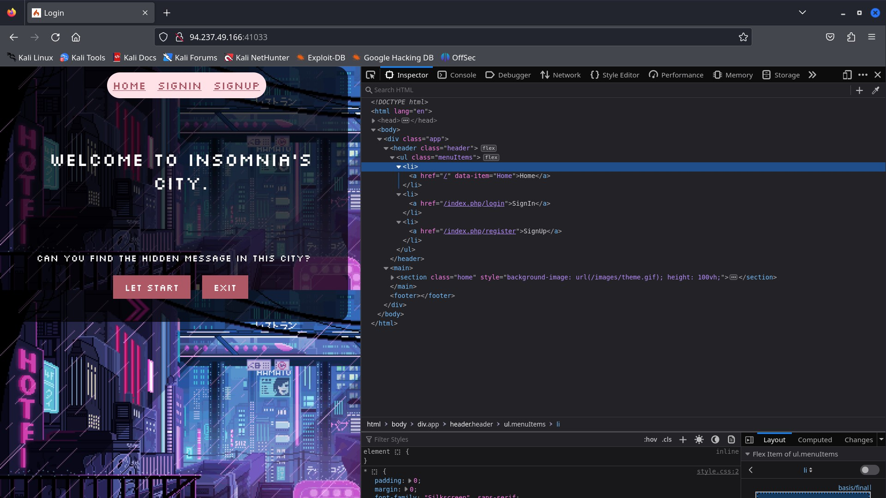
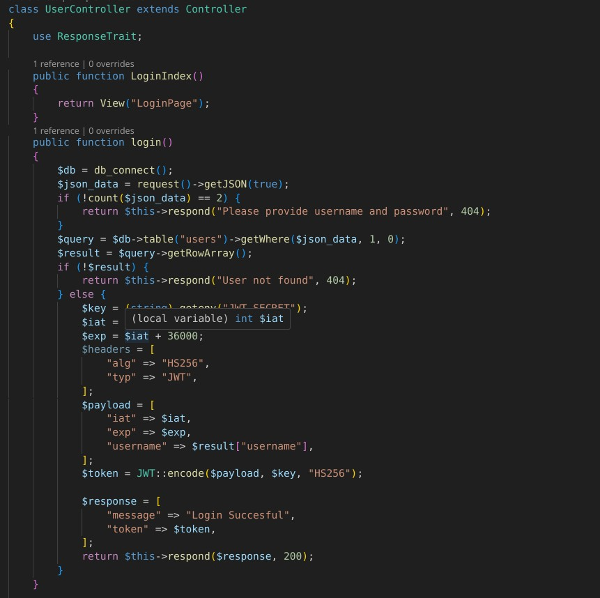
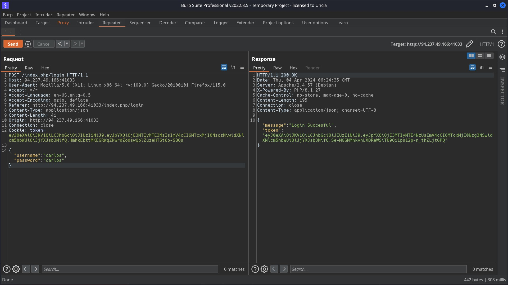
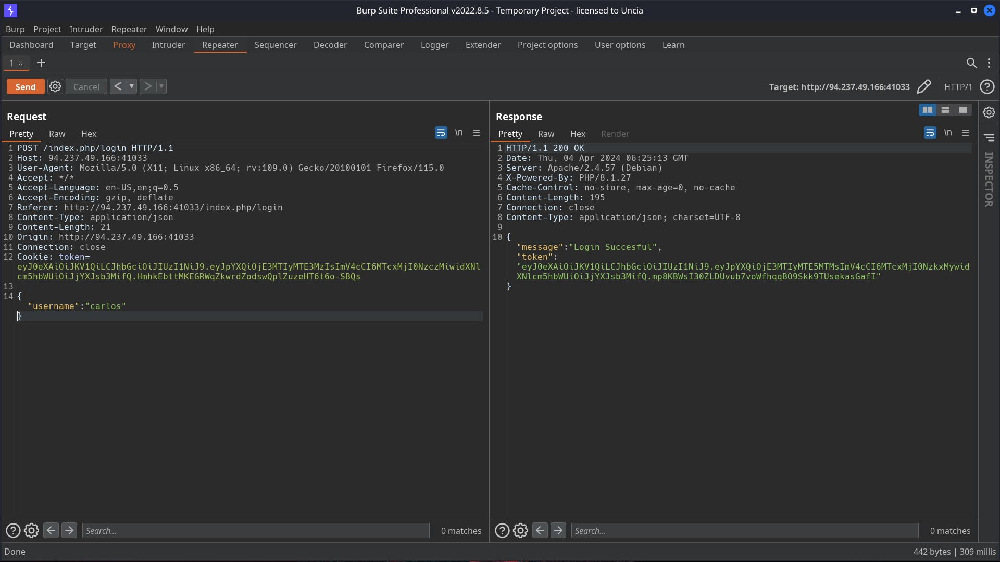
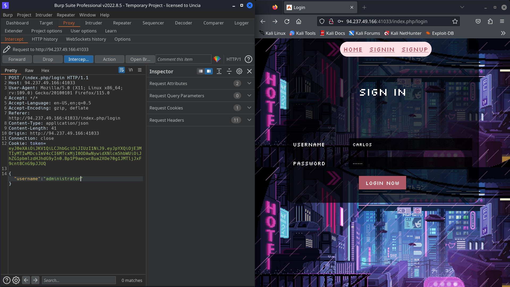
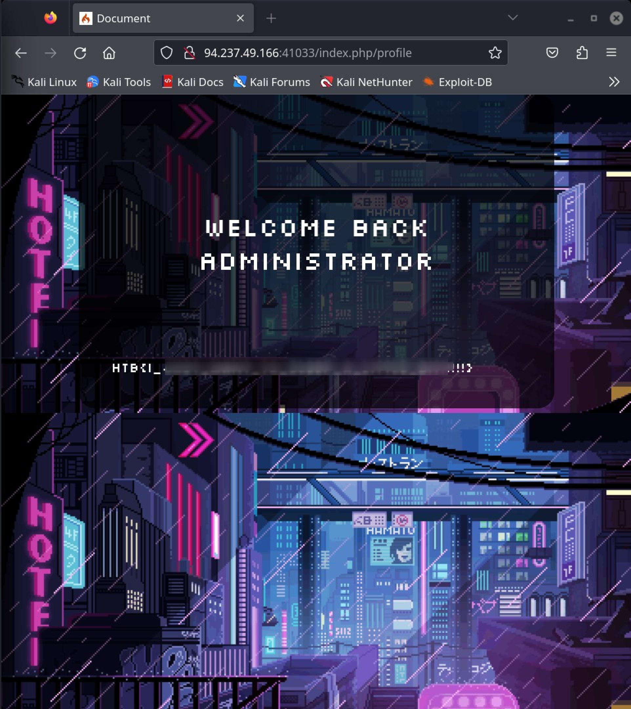
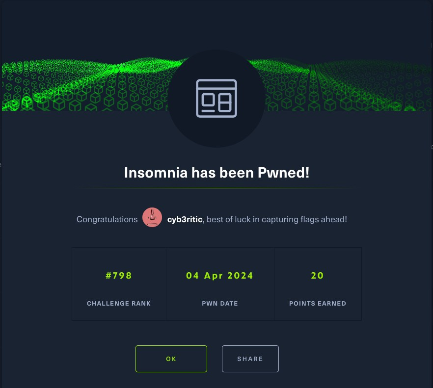

# <center>Insomnia</center>
-  easy web challenge
<hr>

Hello everyone, This is the writeup for Insomnia, an easy labeled web challenege. So, let's solve this challenge together.

First let's start the instance and download the necessary files. Now we can access the page in our browser. The first thing I wanted was to check the source page, so I inspected the wep page.


- we can see three active clickable links, home, signin and signup.

Now let's go deeper and see the downloaded files. There scanning manually through all the file, I reached to app/Controllers directory. There i found something interesting.

1. In app/Controllers/ProfileControllers.php, we see that we can get flag if we are authenticated as administrator. Else we will just get a welcome message on our page.
```php
<?php

namespace App\Controllers;

use App\Controllers\BaseController;
use CodeIgniter\HTTP\ResponseInterface;
use Config\Paths;
use Firebase\JWT\JWT;
use Firebase\JWT\Key;

class ProfileController extends BaseController
{
    public function index()
    {
        $token = (string) $_COOKIE["token"] ?? null;
        $flag = file_get_contents(APPPATH . "/../flag.txt");
        if (isset($token)) {
            $key = (string) getenv("JWT_SECRET");
            $jwt_decode = JWT::decode($token, new Key($key, "HS256"));
            $username = $jwt_decode->username;
            if ($username == "administrator") {
                return view("ProfilePage", [
                    "username" => $username,
                    "content" => $flag,
                ]);
            } else {
                $content = "Haven't seen you for a while";
                return view("ProfilePage", [
                    "username" => $username,
                    "content" => $content,
                ]);
            }
        }
    }
}
<?
```

So my plan was to create a test account and then modify the payload cookie with name parameter as administrator. But I cannot by pass the jwt request since it is being decoded with a 32 bit Hex randblob key. So, need to think a different method.

let's see how a user is being authenticated. For this lets see the app/Controllers/UserController.php,


- Here we can see is the developer is not checking for password, it is only checking if the query ig fetching the result or not.

So what I did next was I created a test account with credentials carlos:carlos and logged in. I also intercepted the request in burp and checked for the response. For carlos:carlos I got a token with login successful status 200 response.


Then I removed teh password field and sent the request again. I still got the login successful response with a token for carlos username.


So What i did next was I reloggedin to carlos account and after intercepting the request, this time,  I removed password field and edited the username to 'administrator' and forwarded the request.


<strong>And voilà, I was logged in as administrator and got the flag.</strong>



Thankyou for reading this writeup. I hope it was interesting and informative. See you soon :)


    
